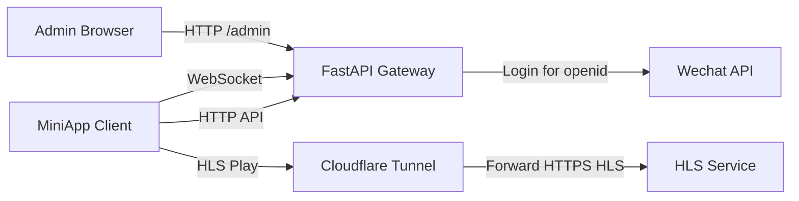
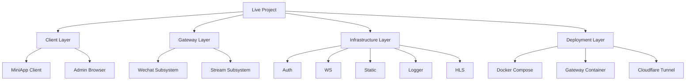
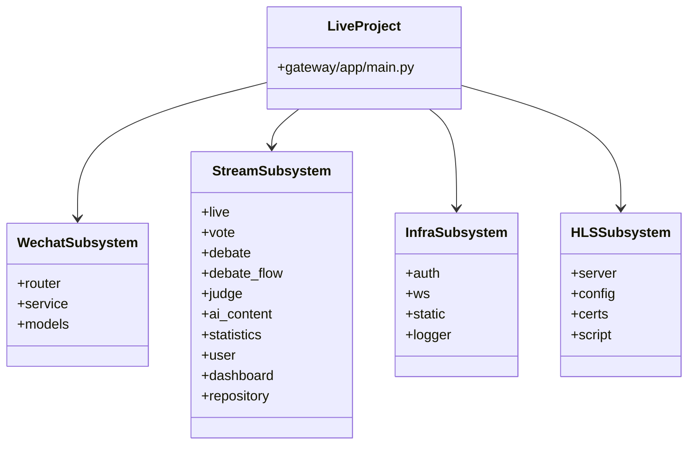
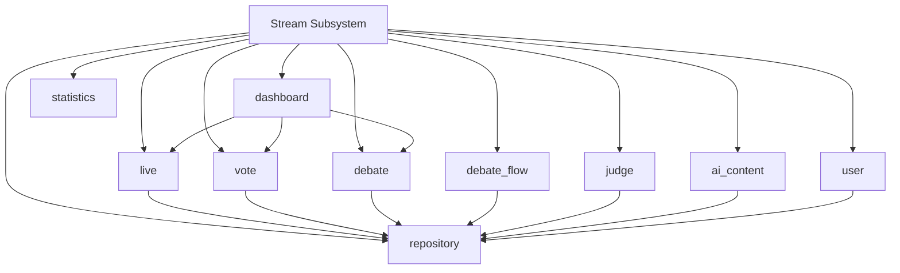
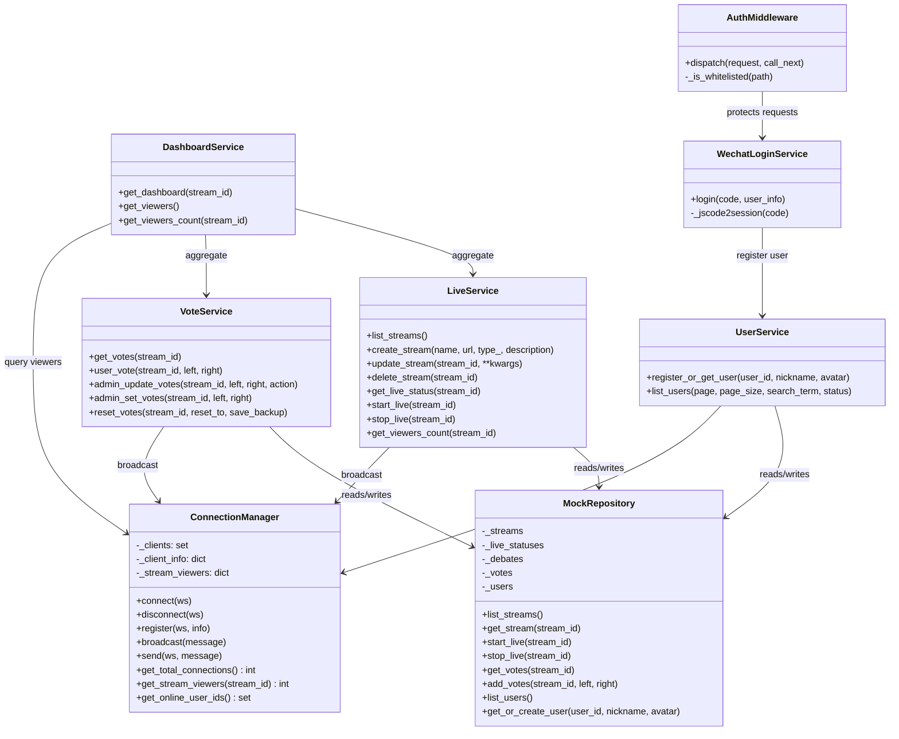
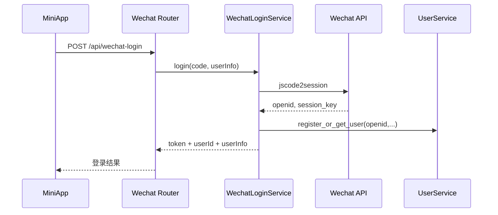
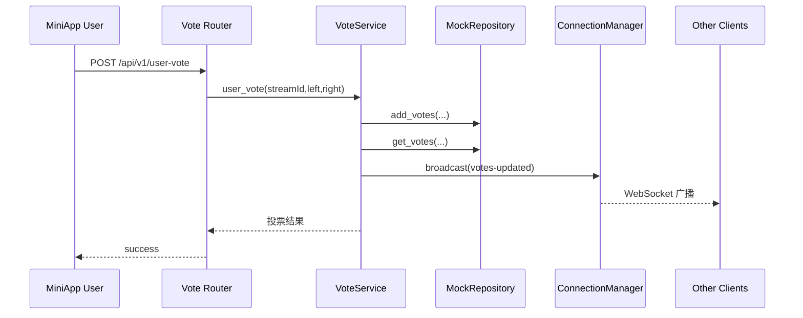
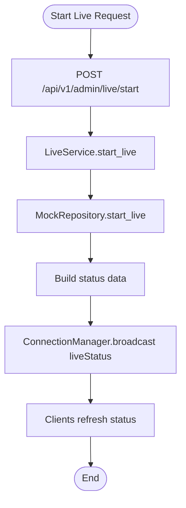

# Live Project 软件架构设计说明

> 文档定位：面向初级软件工程课程的正式设计说明
> 设计粒度：系统 -> 子系统 -> 模块 -> 构件（类）
> 表达方式：Markdown + Mermaid（UML 2.0 风格）

## 1. 设计目标

本项目服务于“直播辩论”场景，目标是在课程项目范围内完成一个具备前后端联调、直播状态控制、实时消息推送与基础部署能力的软件系统原型。

从代码实现看，系统当前采用的是“模块化单体 + 独立辅助服务”的设计方式：

- 统一入口由 `gateway/app/main.py` 提供。
- 业务能力主要集中在 `stream` 与 `wechat` 子系统。
- `WebSocket`、`鉴权`、`静态资源托管`、`日志` 作为基础设施支撑业务模块。
- `HLS` 由独立 FastAPI 静态服务承载，并通过 `entrypoint.sh` 与网关一起启动。

## 2. 系统级架构

### 2.1 系统上下文图

### 2.2 系统分层图

### 2.3 系统设计说明

| 层次 | 当前实现 | 说明 |
| --- | --- | --- |
| 系统 | `Live Project` | 面向直播辩论场景的课程项目原型 |
| 子系统 | `stream`、`wechat`、`hls`、`auth/ws/static/logger` | 业务子系统与基础设施子系统并存 |
| 模块 | `live`、`vote`、`debate`、`user`、`dashboard` 等 | `stream` 子系统内部按业务模块拆分 |
| 构件 | `LiveService`、`VoteService`、`ConnectionManager`、`MockRepository` 等 | 构件层以类、模型、路由处理器为主 |

## 3. 子系统设计

### 3.1 子系统划分图

### 3.2 子系统职责说明

| 子系统 | 路径 | 职责 |
| --- | --- | --- |
| Wechat 子系统 | `gateway/app/subsystems/wechat/` | 完成微信登录、换取 `openid`、生成 JWT，并调用用户注册逻辑 |
| Stream 子系统 | `gateway/app/subsystems/stream/` | 提供直播流、投票、辩题、评委、统计、用户等核心业务能力 |
| WS 通信子系统 | `gateway/app/comm/ws/` | 维护 WebSocket 连接、注册信息、直播间观众集合、广播消息 |
| Auth 子系统 | `gateway/app/infra/auth/` | 统一处理 JWT 白名单与请求鉴权 |
| Static 子系统 | `gateway/app/infra/static/` | 挂载 `/admin` 和 `/static` 静态资源目录 |
| HLS 子系统 | `gateway/app/subsystems/hls/` | 提供 HLS 静态文件 HTTPS 服务 |
| Logger 子系统 | `gateway/app/utils/logger/` | 提供统一日志输出 |

## 4. 模块设计

### 4.1 Stream 子系统模块结构

### 4.2 模块职责表

| 模块 | 主要文件 | 职责 |
| --- | --- | --- |
| `repository` | `repository/mock.py` | 提供当前系统的内存数据存储与 CRUD 能力 |
| `live` | `live/router.py`、`live/service.py`、`live/models.py` | 直播流管理、直播开始/停止、直播状态查询 |
| `vote` | `vote/router.py`、`vote/service.py`、`vote/models.py` | 用户投票、管理员设票、票数广播 |
| `debate` | `debate/router.py`、`debate/service.py`、`debate/models.py` | 辩题创建、更新、绑定直播流 |
| `debate_flow` | `debate_flow/*` | 辩论流程与环节控制 |
| `judge` | `judge/*` | 评委信息管理 |
| `ai_content` | `ai_content/*` | AI 内容、评论、点赞等相关管理 |
| `user` | `user/router.py`、`user/service.py` | 用户列表、在线状态判定 |
| `dashboard` | `dashboard/router.py`、`dashboard/service.py` | 聚合直播状态、票数、辩题、AI 状态等信息 |
| `statistics` | `statistics/*` | 统计数据查询与展示支持 |

## 5. 构件（类）设计

### 5.1 核心构件类图

### 5.2 构件说明

| 构件 | 类型 | 作用 |
| --- | --- | --- |
| `AuthMiddleware` | 基础设施构件 | 负责统一鉴权与白名单放行 |
| `ConnectionManager` | 通信构件 | 负责连接管理、在线状态与广播 |
| `MockRepository` | 数据构件 | 提供当前版本的内存数据源 |
| `LiveService` | 业务构件 | 封装直播流管理与状态切换 |
| `VoteService` | 业务构件 | 封装投票计算与实时广播 |
| `UserService` | 业务构件 | 管理用户注册与在线状态整合 |
| `DashboardService` | 聚合构件 | 为管理端汇总多模块数据 |
| `WechatLoginService` | 外部接口构件 | 与微信接口交互并生成令牌 |

## 6. 关键运行流程

### 6.1 用户登录时序图

### 6.2 投票广播时序图

### 6.3 直播控制活动图

## 7. 架构特点与局限

### 7.1 架构特点

- 统一入口明确：所有 HTTP 与 WebSocket 访问先进入网关。
- 模块划分清晰：`stream` 子系统内部已经形成比较稳定的模块边界。
- 基础设施内聚：鉴权、静态资源、日志、WebSocket 都独立在基础设施目录下。
- 易于教学说明：符合初级软件工程中“系统-子系统-模块-构件”的层次表达。

### 7.2 当前局限

- 数据层仍为 `MockRepository`，不具备持久化和并发一致性保障。
- `stream` 内部虽然模块化，但尚未真正拆分成独立部署服务。
- Docker 编排当前仅覆盖网关与 Cloudflare Tunnel，不含完整前端发布链路。
- 部分业务链路仍存在同步性与状态一致性问题，详见根目录 `README.md`。

## 8. 演进建议

| 阶段 | 建议 |
| --- | --- |
| 第一步 | 为 `repository` 增加数据库实现，保留当前服务层接口 |
| 第二步 | 为 WebSocket 注册、用户在线状态、AI 内容同步补齐测试 |
| 第三步 | 将前端正式发布链路纳入统一部署方案 |
| 第四步 | 根据需要把 `stream` 的高耦合模块拆分成独立服务 |
