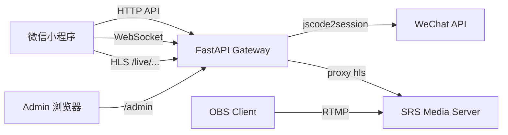
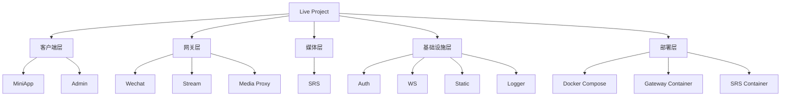
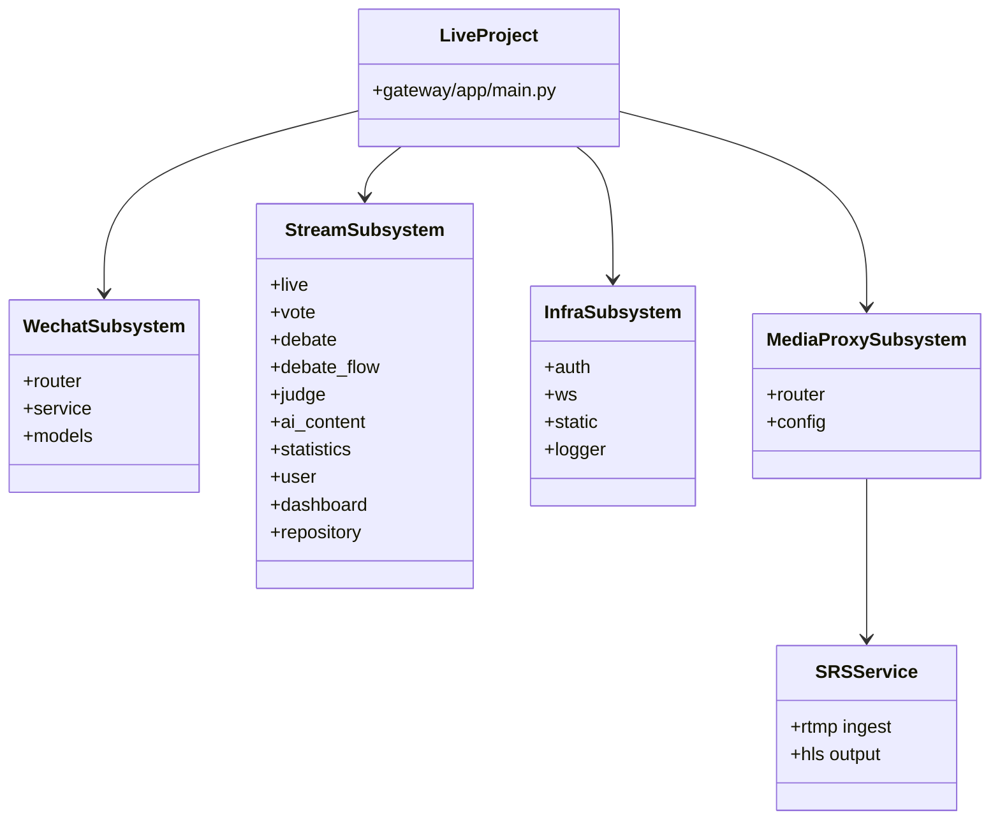
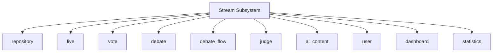
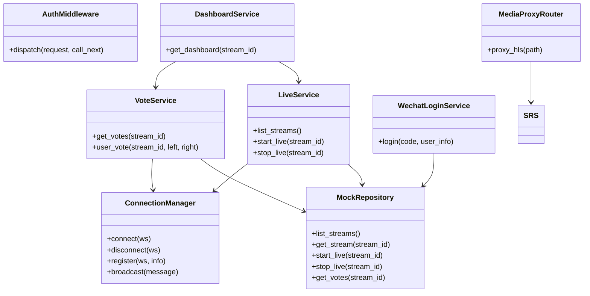
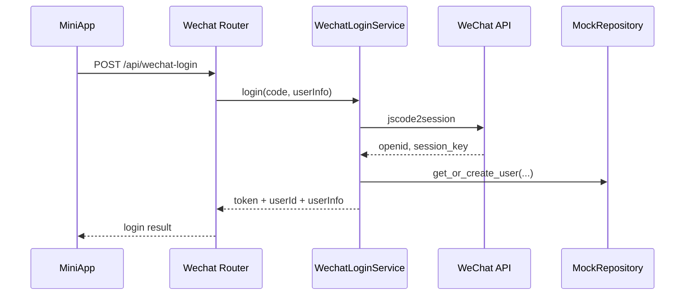
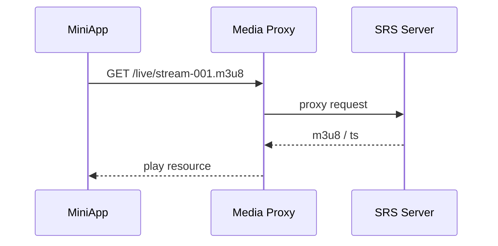
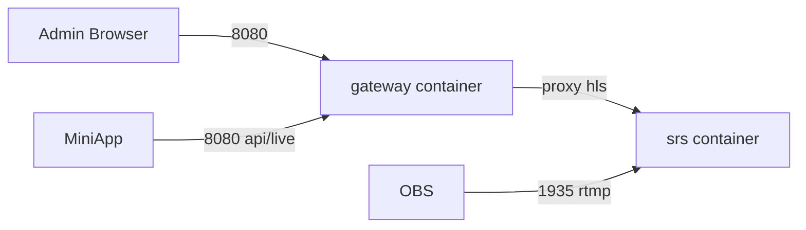

# Live Project 软件架构设计说明

> 文档定位：面向初级软件工程课程的正式设计说明  
> 设计粒度：系统 -> 子系统 -> 模块 -> 构件（类）  
> 表达方式：Markdown + Mermaid（UML 2.0 风格）

## 1. 当前版本架构概览

当前版本采用“模块化单体网关 + 独立媒体服务”的结构。

- FastAPI gateway 是对外统一入口
- 微信小程序 frontend 独立发布到微信，不参与 Docker 部署
- Admin 静态资源位于 gateway 内部，由网关统一托管
- SRS 作为独立媒体服务，接收 OBS 的 RTMP 推流，输出 HLS 播放资源
- 网关通过 `/live/...` 代理 HLS 播放请求
- 小程序前端目前已支持本地模拟器、真机局域网、IP 调试、IP 上线四种运行模式

## 2. 系统级架构

### 2.1 系统上下文图

### 2.2 分层图

### 2.3 系统说明

| 层次 | 当前实现 | 说明 |
| --- | --- | --- |
| 系统 | Live Project | 面向直播辩论场景的课程项目 |
| 子系统 | wechat、stream、auth/ws/static/logger、media proxy | 业务子系统与基础设施子系统共同组成 gateway |
| 模块 | live、vote、debate、user、dashboard 等 | stream 内部按业务职责拆分 |
| 构件 | LiveService、VoteService、ConnectionManager、MockRepository 等 | 以 class、service、router 为主 |
| 独立服务 | SRS | 提供 RTMP 推流与 HLS 输出 |

## 3. 子系统设计

### 3.1 子系统划分图

### 3.2 子系统职责表

| 子系统 | 路径 | 职责 |
| --- | --- | --- |
| Wechat 子系统 | `gateway/app/subsystems/wechat/` | 微信登录、openid 换取、JWT 生成 |
| Stream 子系统 | `gateway/app/subsystems/stream/` | 直播流、投票、辩题、评委、统计、用户等主体业务 |
| WS 子系统 | `gateway/app/comm/ws/` | WebSocket 连接管理、在线状态、消息广播 |
| Auth 子系统 | `gateway/app/infra/auth/` | 统一鉴权与白名单放行 |
| Static 子系统 | `gateway/app/infra/static/` | 托管 `/admin` 和 `/static` 静态资源 |
| Media Proxy 子系统 | `gateway/app/infra/media_proxy/` | 统一暴露 `/live/...` 播放路径，代理 SRS 资源 |
| SRS 媒体服务 | `docker/srs/` | 接收 OBS RTMP 推流，生成 HLS 播放资源 |

## 4. 模块设计

### 4.1 Stream 子系统模块结构

### 4.2 模块职责表

| 模块 | 主要文件 | 职责 |
| --- | --- | --- |
| `repository` | `repository/mock.py` | 提供内存数据存储与 CRUD 能力 |
| `live` | `live/router.py`、`live/service.py`、`live/models.py` | 直播流管理、开播、停播、状态查询 |
| `vote` | `vote/router.py`、`vote/service.py`、`vote/models.py` | 用户投票、管理员设票、票数广播 |
| `debate` | `debate/router.py`、`debate/service.py`、`debate/models.py` | 辩题创建、修改、绑定直播流 |
| `dashboard` | `dashboard/router.py`、`dashboard/service.py` | 聚合直播状态、票数、辩题、AI 状态等信息 |
| `media_proxy` | `infra/media_proxy/router.py` | 代理 m3u8 清单和分片资源 |

## 5. 构件（类）设计

### 5.1 核心构件类图

### 5.2 构件说明

| 构件 | 类型 | 作用 |
| --- | --- | --- |
| `AuthMiddleware` | 基础设施构件 | 统一鉴权与白名单放行 |
| `ConnectionManager` | 通信构件 | WebSocket 连接管理、在线状态与消息广播 |
| `MockRepository` | 数据构件 | 当前版本的内存数据源 |
| `LiveService` | 业务构件 | 直播流管理与状态切换 |
| `VoteService` | 业务构件 | 投票计算与实时广播 |
| `DashboardService` | 聚合构件 | 后台统计信息汇总 |
| `WechatLoginService` | 外部接口构件 | 与 WeChat API 交互并生成令牌 |
| `MediaProxyRouter` | 媒体入口构件 | 提供统一的 `/live/...` 播放地址 |

## 6. 关键运行流程

### 6.1 用户登录时序图

### 6.2 播放访问时序图

## 7. 部署架构

### 7.1 Docker 部署图

### 7.2 部署说明

| 项目 | 当前版本 |
| --- | --- |
| 网关服务 | FastAPI，提供 API、Admin、WebSocket、播放代理 |
| 媒体服务 | SRS，负责 RTMP 推流与 HLS 输出 |
| 前端发布 | 微信小程序独立发布，不纳入 Docker |
| Admin 发布 | 静态文件随 gateway 一起部署 |
| 环境切换 | local / staging / prod |

## 8. 架构特点与局限

### 8.1 架构特点

- 统一入口明确：HTTP、WebSocket、Admin 和 `/live/...` 都由 gateway 对外暴露
- 媒体职责清晰：SRS 负责媒体协议，gateway 负责业务控制
- 前后端边界明确：frontend 独立发布，Admin 由 gateway 托管
- 符合初级软件工程设计的层次表达方式

### 8.2 当前局限

- 数据层仍然为 `MockRepository`，不具备持久化能力
- 项目目前仍以 HTTP 访问为主，HTTPS 属于后续改进方向
- 媒体层已独立，但整体仍处于课程原型阶段

## 9. 演进建议

| 阶段 | 建议 |
| --- | --- |
| 第一步 | 为 repository 提供数据库实现 |
| 第二步 | 补齐直播状态同步和 WebSocket 注册测试 |
| 第三步 | 把 SRS 接入、回调管理、播放地址生成沉淀为正式 media 子系统 |
| 第四步 | 根据上线需求补齐 HTTPS、域名和统一接入层 |
