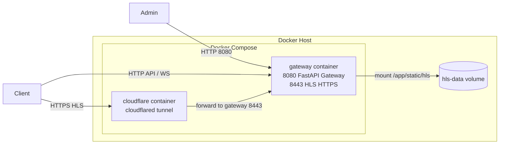
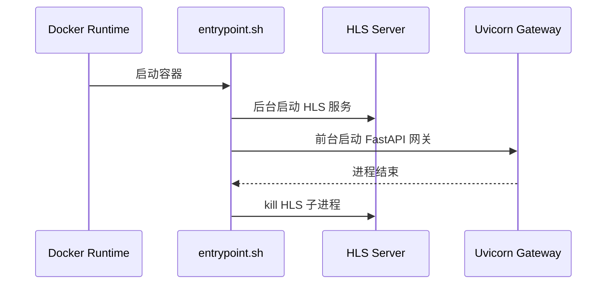
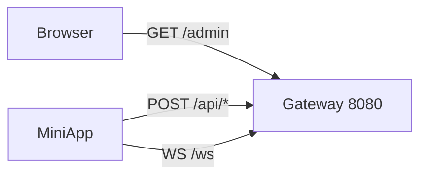

# Live Project Docker 部署设计说明

> 文档定位：描述当前仓库在 Docker 条件下的真实部署方式
> 表达方式：Markdown + Mermaid（部署图、时序图）

## 1. 部署目标

当前仓库中的 Docker 方案主要解决以下问题：

- 将 `gateway/` 打包为可运行容器；
- 挂载 HLS 静态文件目录；
- 使用 Cloudflare Tunnel 暴露 HLS HTTPS 地址，便于手机或微信环境访问；
- 通过 `docker/start.sh` 自动抓取 Tunnel 域名，并回填到前端直播配置文件中。

需要强调的是：当前 Docker Compose 并未直接编排 `frontend/` 工程，因此它是“网关与流媒体访问链路”的部署方案，不是全系统一体化部署方案。

## 2. 部署单元

### 2.1 Compose 文件中的服务

当前 `docker/docker-compose.yml` 定义了两个服务：

| 服务名 | 镜像/构建 | 作用 |
| --- | --- | --- |
| `gateway` | 由 `../gateway/Dockerfile` 构建 | 提供 FastAPI 网关、管理后台、WebSocket，并在容器内启动 HLS 服务 |
| `cloudflare` | `cloudflare/cloudflared:latest` | 将 HLS 地址通过临时 Tunnel 域名暴露为 HTTPS 地址 |

### 2.2 容器部署图



## 3. 容器内部运行设计

### 3.1 `gateway` 容器内部结构

```mermaid
flowchart TB
    Entry[entrypoint.sh]
    APIServer[uvicorn app.main:app\n0.0.0.0:8080]
    HLSServer[python -m hls_server start\nstandalone FastAPI static service]
    StaticDir[/app/static]
    HLSDir[/app/static/hls]

    Entry --> HLSServer
    Entry --> APIServer
    HLSServer --> HLSDir
    APIServer --> StaticDir
```

### 3.2 `entrypoint.sh` 启动时序



## 4. 端口、卷与环境变量

### 4.1 端口设计

| 端口 | 所属 | 用途 |
| --- | --- | --- |
| `8080` | `gateway` 容器 | 对外 HTTP API、管理后台、WebSocket |
| `8443` | `gateway` 容器内部 | HLS HTTPS 静态服务，供 Tunnel 转发 |

### 4.2 数据卷设计

| 主机路径 | 容器路径 | 用途 |
| --- | --- | --- |
| `./hls-data` | `/app/static/hls` | 持久化 HLS 流文件 |

### 4.3 环境变量来源

`docker/docker-compose.yml` 当前通过 `env_file` 加载：

- `../gateway/.env`

从现有仓库看，`docker/.env` 中已经包含部署所需的一组典型变量，例如：

- `ROOT_DOMAIN`
- `GATEWAY_BIND_IP`
- `GATEWAY_PORT`
- `PUBLIC_BASE_URL`
- `LIVE_BASE_URL`
- `PUSH_BASE_URL`
- `CF_TUNNEL_TOKEN`

说明：当前 Compose 文件与 `docker/.env` 的组织尚未完全统一，属于后续可以继续规范化的部分。

## 5. 访问路径设计

### 5.1 API 与管理后台



### 5.2 HLS 访问路径


## 6. 启动与停止流程

### 6.1 启动流程

推荐从 `docker/` 目录执行：

```bash
docker compose up -d --build
```

或者：

```bash
./start.sh
```

`start.sh` 的当前职责包括：

1. 启动 Compose 服务；
2. 轮询 `cloudflare` 容器日志，提取 `trycloudflare.com` 域名；
3. 将获取到的 Tunnel 地址回填到 `frontend/config/live-config.js` 中；
4. 输出 API 与 HLS 调试地址。

### 6.2 停止流程

```bash
./stop.sh
```

脚本本质上执行：

```bash
docker compose down
```

## 7. 当前部署特点

### 7.1 优点

- 启动路径简单，适合课程演示和联调。
- HLS、API、管理后台可以围绕同一网关容器组织。
- 借助 Tunnel，可以较方便解决移动端 HTTPS/HLS 调试问题。

### 7.2 局限

- 前端工程未被正式纳入 Compose 编排。
- Cloudflare Tunnel 依赖临时地址，适合演示，不适合作为正式生产方案。
- HLS 与 API 共同绑定在 `gateway` 容器生命周期内，长期演进时可以考虑拆分。
- 环境变量文件位置与职责尚有整理空间。

## 8. 建议的后续演进

| 方向 | 建议 |
| --- | --- |
| 配置管理 | 明确 `gateway/.env` 与 `docker/.env` 的职责边界 |
| 前端部署 | 将 `frontend/` 的构建产物与发布方式纳入统一部署文档 |
| 正式 HTTPS | 用正式域名和证书替代临时 Tunnel |
| 服务拆分 | 如系统规模扩大，可将 HLS 与 API 网关拆成独立服务 |
