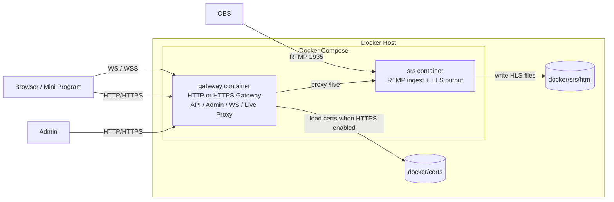
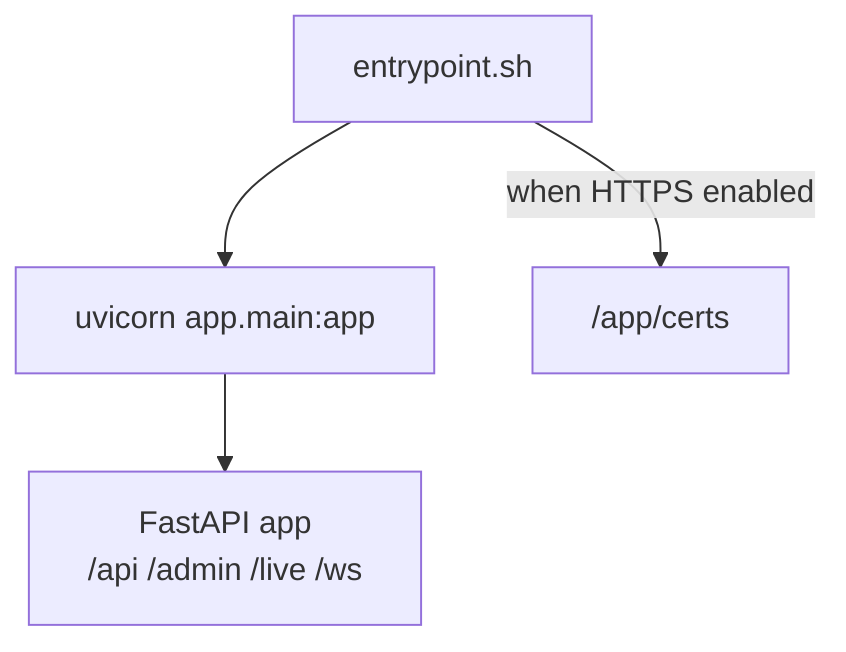
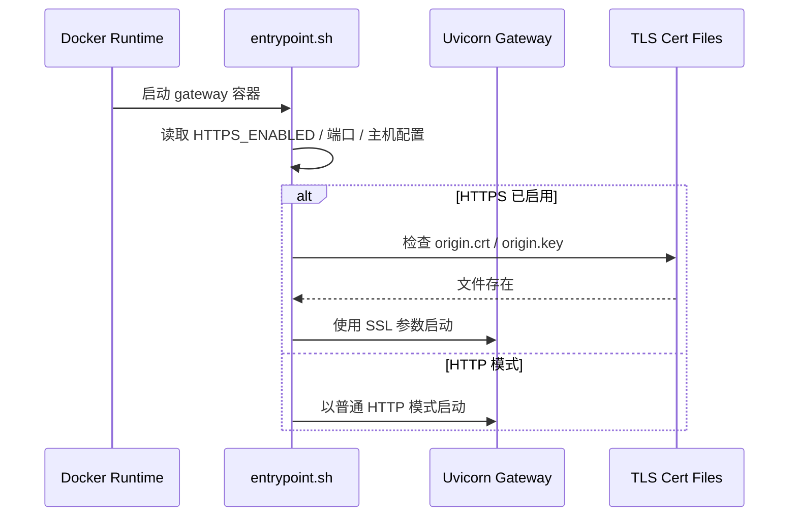
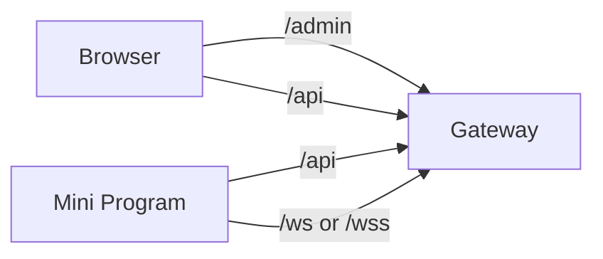
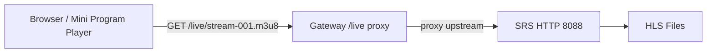

# Live Project Docker 部署设计说明

> 文档定位：描述当前仓库在 Docker 条件下的真实部署方式
> 表达方式：Markdown + Mermaid（部署图、时序图）

## 1. 部署目标

当前仓库中的 Docker 方案主要解决以下问题：

- 将 `gateway/` 构建为统一入口容器
- 将 `srs` 作为独立媒体服务容器运行
- 在不同环境下通过 `.env.local`、`.env.staging`、`.env.prod` 控制协议、端口、域名与 HTTPS 能力
- 为 `local -> staging -> prod` 的递进部署提供统一编排基础

需要强调的是：

- `frontend/` 微信小程序不参与 Docker 部署
- Admin 静态资源由 `gateway` 托管
- OBS 推流继续走公网 IP 的 RTMP 端口，不走 Cloudflare 代理

## 2. 部署单元

### 2.1 Compose 文件中的服务

当前 `docker/docker-compose.yml` 定义了两个服务：

| 服务名 | 镜像/构建 | 作用 |
| --- | --- | --- |
| `gateway` | 由 `../gateway/Dockerfile` 构建 | 提供 FastAPI 网关、管理后台、API、WebSocket、`/live` 播放代理 |
| `srs` | `${SRS_IMAGE}` | 提供 RTMP 推流接入与 HLS 文件输出 |

### 2.2 容器部署图



## 3. 容器内部运行设计

### 3.1 `gateway` 容器内部结构



### 3.2 `entrypoint.sh` 启动时序



## 4. 端口、卷与环境变量

### 4.1 端口设计

| 端口 | 所属 | 用途 |
| --- | --- | --- |
| `8080` | `gateway` | local / staging 的 HTTP 入口 |
| `443` | `gateway` | prod 的 HTTPS 入口 |
| `1935` | `srs` | OBS RTMP 推流入口 |
| `8088` | `srs` | Gateway 访问 SRS HLS 文件的内部 HTTP 入口 |

说明：

- `gateway` 实际对外暴露哪个端口，由 `GATEWAY_BIND_PORT` 与 `GATEWAY_INTERNAL_PORT` 决定
- `prod` 目标是 `443 -> 443`
- `staging` 允许先使用 `8080 -> 8080` 做公网集成测试

### 4.2 数据卷设计

| 主机路径 | 容器路径 | 用途 |
| --- | --- | --- |
| `./srs/html` | `/usr/local/srs/objs/nginx/html` | SRS 输出 HLS 文件 |
| `./srs/html` | `/app/runtime/srs-html` | Gateway 读取 HLS 回退文件 |
| `./certs` | `/app/certs` | 挂载 Cloudflare Origin CA 证书与私钥 |

### 4.3 环境变量分组

当前版本推荐按以下分组组织三套 `.env`：

- Runtime
- Mirror / Build Source
- Access Strategy
- Gateway Ports
- HTTPS / TLS
- Media
- WeChat
- Security

关键变量示例：

| 字段 | 作用 |
| --- | --- |
| `HTTPS_ENABLED` | 是否启用 HTTPS |
| `DOMAIN_ENABLED` | 是否启用域名模式 |
| `CLOUDFLARE_ENABLED` | 是否进入 Cloudflare 回源场景 |
| `GATEWAY_INTERNAL_PORT` | 容器内监听端口 |
| `GATEWAY_BIND_PORT` | 宿主机暴露端口 |
| `TLS_CERT_FILE` | 容器内证书路径 |
| `TLS_KEY_FILE` | 容器内私钥路径 |
| `PUBLIC_BASE_URL` | 当前环境对外基础地址 |
| `PRODUCTION_PUSH_BASE` | 生产环境 RTMP 推流基础地址 |

## 5. 访问路径设计

### 5.1 API / Admin / WebSocket



### 5.2 播放路径



### 5.3 推流路径


## 6. 三阶段部署方式

### 6.1 local

特点：

- 使用 HTTP
- 不启用域名
- 不启用 Cloudflare

启动命令：

```bash
cd docker
docker compose --env-file .env.local -f docker-compose.yml -f docker-compose.local.yml up -d --build
```

### 6.2 staging

特点：

- 作为公网集成测试环境
- 允许按能力逐步开启：公网 IP -> 域名 HTTP -> 域名 HTTPS

启动命令：

```bash
cd docker
docker compose --env-file .env.staging -f docker-compose.yml -f docker-compose.staging.yml up -d --build
```

### 6.3 prod

特点：

- 统一收口到 HTTPS / WSS
- 通过 Cloudflare + Gateway 实现正式接入
- 需要证书挂载到 `docker/certs/`

启动命令：

```bash
cd docker
docker compose --env-file .env.prod -f docker-compose.yml -f docker-compose.prod.yml up -d --build
```

## 7. 当前部署特点

### 7.1 优点

- 网关与媒体服务职责分离，结构清晰
- 同一套代码可在 local / staging / prod 之间切换
- HTTPS 被纳入基础设施层，而不是侵入业务子系统
- `/api`、`/admin`、`/live`、`/ws` 统一由 Gateway 管理

### 7.2 局限

- OBS 推流仍依赖公网 IP 与 RTMP 端口
- Cloudflare 只参与 HTTP/HTTPS 链路，不参与 RTMP
- 当前仍处于快速原型阶段，正式生产还需要更多监控与安全加固

## 8. 后续演进建议

| 方向 | 建议 |
| --- | --- |
| HTTPS 联调 | 补齐 prod 的真实证书落位与回源验证记录 |
| WebSocket | 补充 `WSS` 联调说明与异常处理清单 |
| 文档体系 | 保持 `docker-deployment`、`local-to-production-guide`、`api-reference` 三份文档同步演进 |
| 架构治理 | 随着规模扩大，进一步明确媒体层与网关基础设施层的边界 |
