# 用户主动投票活动图（UML Activity Diagram）

> 从前端角度描述用户主动触发投票的完整流程：用户操作 → 前端状态变化 → API 请求 → API 响应处理

## 活动图

```mermaid
flowchart TD
    %% 样式定义
    classDef userAction fill:#E3F2FD,stroke:#1565C0,stroke-width:2px,color:#0D47A1
    classDef frontendState fill:#FFF3E0,stroke:#E65100,stroke-width:2px,color:#BF360C
    classDef apiCall fill:#F3E5F5,stroke:#6A1B9A,stroke-width:2px,color:#4A148C
    classDef decision fill:#FFEBEE,stroke:#C62828,stroke-width:2px,color:#B71C1C
    classDef success fill:#E8F5E9,stroke:#2E7D32,stroke-width:2px,color:#1B5E20
    classDef error fill:#FFEBEE,stroke:#C62828,stroke-width:2px,color:#B71C1C
    classDef effect fill:#FCE4EC,stroke:#AD1457,stroke-width:1px,color:#880E4F

    %% ===== 阶段1: 用户点击 =====
    Start([用户点击投票按钮]):::userAction --> BtnCheck{点击的是哪个按钮?}:::decision

    BtnCheck -->|正方 ⚔️| voteLeft["voteLeft()"]:::userAction
    BtnCheck -->|反方 🛡️| voteRight["voteRight()"]:::userAction

    %% ===== 阶段2: 前置校验 =====
    voteLeft --> Guard1{"isLiveStarted?\n(直播是否开始)"}:::decision
    voteRight --> Guard2{"isLiveStarted?\n(直播是否开始)"}:::decision

    Guard1 -->|否| Abort1[直接返回\n不做任何处理]:::error
    Guard2 -->|否| Abort1

    Guard1 -->|是| RateCheck{"checkVoteRateLimit()\n距上次投票 ≥ 200ms?"}:::decision
    Guard2 -->|是| RateCheck

    RateCheck -->|否\n快速连击被限流| Abort2[静默忽略\n不做任何处理]:::error
    RateCheck -->|是| handleVote["handleVote(side)"]:::frontendState

    %% ===== 阶段3: 前端即时反馈 =====
    handleVote --> UpdateClickCount["更新点击计数\nleftClickCount++ 或\nrightClickCount++"]:::frontendState
    UpdateClickCount --> UpdateLocalVotes["更新本地票数\nleftVotes/rightVotes += 10\nuserVote = side"]:::frontendState

    UpdateLocalVotes --> TriggerEffects["触发视觉特效"]:::effect
    TriggerEffects --> EffectButton["triggerButtonEffect(side)\n按钮高亮动画 1.2s"]:::effect
    TriggerEffects --> EffectDivider["triggerDividerHit()\n闪电分割线特效"]:::effect
    TriggerEffects --> EffectEmoji["createVoteEffects(side)\n表情符号飘动"]:::effect
    TriggerEffects --> ShowToast["showVoteToastOptimized(side)\n底部投票提示"]:::effect
    TriggerEffects --> Vibration["triggerVibrationFeedback(side)\n触觉反馈+音效"]:::effect

    UpdateLocalVotes --> NextTick["$nextTick 回调"]:::frontendState
    NextTick --> UpdateSlider["debouncedUpdatePresetOpinion()\n防抖更新预设滑块"]:::frontendState

    UpdateLocalVotes --> MarkChanged{"isLiveStarted?"}:::decision
    MarkChanged -->|是| SetFlag["votesChanged = true\n标记票数已改变"]:::frontendState
    MarkChanged -->|否| WaitConfirm["等待用户确认提交"]:::frontendState

    %% ===== 阶段4: 用户确认提交 =====
    SetFlag --> WaitConfirm
    WaitConfirm --> UserConfirm[用户拖动滑块\n调整后点击确认按钮]:::userAction

    UserConfirm --> WhichMode{"isLiveStarted?\n确认投票模式"}:::decision

    %% ===== 分支A: 直播前初始投票 =====
    WhichMode -->|否\n直播前| PreLiveCalc["根据 presetOpinion 计算\nleftDist / rightDist\n(总和=100)"]:::frontendState
    PreLiveCalc --> PreScale{"总和 ≠ 100?\n按比例缩放"}:::decision
    PreScale -->|是| DoScale1["scale = 100/total\n按比例调整"]:::frontendState
    PreScale -->|否| APICall1
    DoScale1 --> APICall1

    %% ===== 分支B: 直播中投票更新 =====
    WhichMode -->|是\n直播中| InLiveCheck{"当前票数 = 0?"}:::decision
    InLiveCheck -->|是| UseSlider["根据 presetOpinion 计算票数\nleftVotes/rightVotes"]:::frontendState
    InLiveCheck -->|否| UseCurrent["使用当前 leftVotes/rightVotes"]:::frontendState
    UseSlider --> InLiveScale
    UseCurrent --> InLiveScale

    InLiveScale{"总和 ≠ 100?\n按比例缩放"}:::decision
    InLiveScale -->|是| DoScale2["scale = 100/total\n按比例调整"]:::frontendState
    InLiveScale -->|否| APICall2
    DoScale2 --> APICall2

    %% ===== 阶段5: API 请求发送 =====
    APICall1["confirmPresetVotes()\n→ sendUserVote(side)"]:::apiCall
    APICall2["confirmPresetVotes()\n→ service.userVoteDistribution()"]:::apiCall

    APICall1 --> ValidateStream{"streamId 存在?"}:::decision
    APICall2 --> ValidateStream

    ValidateStream -->|否| ErrNoStream["Toast: 投票失败-未指定直播间"]:::error
    ValidateStream -->|是| GetUserId["获取 userId\n(uni.getStorageSync)\n默认 guest"]:::frontendState

    GetUserId --> BuildRequest["构建请求体\nPOST /api/v1/user-vote\n{leftVotes, rightVotes,\n streamId, userId}"]:::apiCall

    BuildRequest --> TryFormats["逐个尝试4种请求格式\n(路径×包装方式)"]:::apiCall

    TryFormats --> TryEach{"当前格式成功?\n(HTTP 200)"}:::decision
    TryEach -->|否| TryNext["尝试下一种格式"]:::apiCall
    TryNext --> TryEach
    TryEach -->|是| CheckResponse

    %% ===== 阶段6: 响应处理 =====
    CheckResponse{"response.success?"}:::decision

    CheckResponse -->|成功| UpdateTopBar["立即更新顶栏\ntopLeftVotes = leftDist\ntopRightVotes = rightDist"]:::success
    UpdateTopBar --> FetchCumulative["fetchTopBarVotes()\n拉取累计票数校正顶栏"]:::success
    FetchCumulative --> DebouncedFetch["debouncedFetchVoteData()\n延迟1秒再刷新\n确保最终一致"]:::success
    DebouncedFetch --> UpdatePerf["updatePerformanceStats()\n更新性能统计"]:::success
    UpdatePerf --> ClearFlags["清除标记\nvotesChanged = false\ninitialVotesSubmitted = true"]:::success
    ClearFlags --> SuccessToast["Toast: ✅ 投票已提交/已更新"]:::success
    SuccessToast --> End([投票流程结束]):::success

    CheckResponse -->|失败| HandleError["进入 catch 分支"]:::error
    HandleError --> ErrorClassify{"错误状态码?"}:::decision
    ErrorClassify -->|400| Err400["Toast: 请求参数错误"]:::error
    ErrorClassify -->|401| Err401["Toast: 未授权-请先登录"]:::error
    ErrorClassify -->|403| Err403["Toast: 服务器拒绝-CORS配置"]:::error
    ErrorClassify -->|404| Err404["Toast: 接口不存在"]:::error
    ErrorClassify -->|500| Err500["Toast: 服务器内部错误"]:::error
    ErrorClassify -->|其他| ErrOther["Toast: 投票失败\n(handleError 解析)"]:::error

    Err400 --> EndError([投票失败结束]):::error
    Err401 --> EndError
    Err403 --> EndError
    Err404 --> EndError
    Err500 --> EndError
    ErrOther --> EndError
    ErrNoStream --> EndError
```

## 流程说明

### 整体架构分为 6 个阶段

| 阶段 | 说明 | 关键文件:行号 |
|------|------|-------------|
| 1. 用户点击 | 点击正方/反方投票按钮 | `home.vue:264-280` |
| 2. 前置校验 | 直播状态检查 + 200ms 速率限制 | `home.vue:2324-2359` |
| 3. 前端即时反馈 | 本地票数 +10、视觉特效、音效 | `home.vue:2362-2413` |
| 4. 用户确认提交 | 拖动滑块调整分布后点击确认 | `home.vue:2745-2863` |
| 5. API 请求 | POST `/api/v1/user-vote`，尝试多格式 | `api-service.js:388-531` |
| 6. 响应处理 | 成功更新顶栏+校正；失败分类提示 | `home.vue:1945-1986` |

### 关键设计要点

1. **乐观更新**：点击投票后立即更新本地显示（+10 票），不等服务器响应
2. **延迟提交**：直播中模式下，点击投票只更新前端，需拖动滑块确认后才发送 API
3. **速率限制**：每侧投票最少 200ms 间隔，防止快速连击
4. **多格式容错**：API 请求尝试 4 种 URL+数据格式组合，确保兼容不同后端版本
5. **双重校正**：API 成功后先立即更新，再通过 `fetchTopBarVotes()` + `debouncedFetchVoteData()` 确保累计值最终一致
