# WebSocket 被动接收投票推送活动图（UML Activity Diagram）

> 从前端角度描述 WebSocket 推送投票更新后的完整流程：WS 消息到达 → 前端状态更新 → UI 渲染变化

## 活动图

```mermaid
flowchart TD
    %% 样式定义
    classDef wsEvent fill:#E8EAF6,stroke:#283593,stroke-width:2px,color:#1A237E
    classDef wsInternal fill:#E3F2FD,stroke:#1565C0,stroke-width:1px,color:#0D47A1
    classDef frontendState fill:#FFF3E0,stroke:#E65100,stroke-width:2px,color:#BF360C
    classDef decision fill:#FFEBEE,stroke:#C62828,stroke-width:2px,color:#B71C1C
    classDef uiUpdate fill:#E8F5E9,stroke:#2E7D32,stroke-width:2px,color:#1B5E20
    classDef fallback fill:#FFF8E1,stroke:#F57F17,stroke-width:2px,color:#E65100
    classDef lifecycle fill:#F3E5F5,stroke:#6A1B9A,stroke-width:2px,color:#4A148C

    %% ===== 阶段0: WebSocket 连接建立（背景） =====
    subgraph Connection ["WebSocket 连接生命周期"]
        direction TB
        WSInit["connectWebSocket()\n构建 ws://server/ws URL"]:::lifecycle
        WSInit --> WSTry["uni.connectSocket({url})"]:::lifecycle
        WSTry --> WSSuccess{"连接成功?"}:::decision
        WSSuccess -->|是| WSOnOpen["onOpen 回调\n重置重连计数=0"]:::lifecycle
        WSOnOpen --> StartHeartbeat["startWSHeartbeat()\n每30秒发送 ping"]:::lifecycle
        StartHeartbeat --> StopPolling["stopLiveStatusPolling()\n停止轮询降级"]:::lifecycle
        StopPolling --> Register["发送 register 消息\nclientType=miniprogram"]:::lifecycle

        WSSuccess -->|否| WSOnFail["onFail 回调"]:::lifecycle
        WSOnFail --> ScheduleReconnect

        WSOnOpen --> WSListen["开始监听消息\nonMessage / onClose / onError"]:::lifecycle

        WSOnClose["onClose 回调\n(intentionalClose?)"]:::lifecycle
        WSOnClose -->|主动关闭| WSIdle[不重连]:::lifecycle
        WSOnClose -->|非主动| ScheduleReconnect

        WSError["onError 回调"]:::lifecycle
        WSError --> ScheduleReconnect

        ScheduleReconnect["scheduleWSReconnect()\n指数退避: 1s→2s→4s...→30s\n最大重连次数限制"]:::lifecycle
        ScheduleReconnect --> StartPolling["startLiveStatusPolling()\n启动轮询降级\n每5秒 fetchLiveStatus()"]:::fallback
    end

    WSListen -.->|监听中| MsgReceived

    %% ===== 阶段1: 消息接收 =====
    MsgReceived["onMessage 回调\n收到 WebSocket 文本帧"]:::wsEvent

    MsgReceived --> ParseJSON["JSON.parse(res.data)"]:::wsInternal
    ParseJSON --> ParseOK{"解析成功?"}:::decision
    ParseOK -->|否| ParseFail[静默忽略\ncatch 空处理]:::wsInternal
    ParseOK -->|是| HandleMsg["handleWSMessage(data)"]:::wsEvent

    %% ===== 阶段2: 消息分发 =====
    HandleMsg --> StreamFilter{"多直播过滤\nthis.streamId 存在?\n且与 data.streamId 不同?"}:::decision
    StreamFilter -->|是| IgnoreMsg["忽略：非当前直播间消息"]:::wsInternal
    StreamFilter -->|否| SwitchType{"switch(data.type)"}:::decision

    SwitchType -->|"liveStatus\nlive-status-changed"| HandleLive["handleLiveStatusUpdate()"]:::wsInternal
    SwitchType -->|"aiStatus"| HandleAI["handleAIStatusUpdate()"]:::wsInternal
    SwitchType -->|"votesUpdate\nvotes-updated"| HandleVotes["handleVotesUpdate(data)"]:::wsEvent
    SwitchType -->|"newAIContent"| HandleNewAI["handleNewAIContent()"]:::wsInternal
    SwitchType -->|"aiContentDeleted"| HandleDelAI["handleAIContentDeleted()"]:::wsInternal
    SwitchType -->|"pong"| HandlePong["心跳响应-忽略"]:::wsInternal
    SwitchType -->|default| HandleDefault["未知类型-忽略"]:::wsInternal

    %% ===== 阶段3: 投票数据处理（核心） =====
    HandleVotes --> VoteStreamCheck{"streamId 匹配检查\nstreamId === currentStreamId\n或 streamId === null?"}:::decision
    VoteStreamCheck -->|不匹配| IgnoreVote["忽略：其他直播流投票"]:::wsInternal

    VoteStreamCheck -->|匹配| CheckVotesData{"data.leftVotes 且\ndata.rightVotes\n存在?"}:::decision

    CheckVotesData -->|否| CheckPercentage
    CheckVotesData -->|是| ParseVoteValues["解析票数值\nleftVal = Number(data.leftVotes)\nrightVal = Number(data.rightVotes)"]:::frontendState

    ParseVoteValues --> CheckIncrement{"leftVal < 0\n或 rightVal < 0?\n(增量模式)"}:::decision

    %% 增量更新分支
    CheckIncrement -->|是\n增量模式| IncUpdate["增量累加到当前值\ntopLeftVotes += leftVal\ntopRightVotes += rightVal\n(取 max(0, ...))"]:::frontendState
    IncUpdate --> DebouncedFetch["debouncedFetchVoteData()\n延迟1秒拉取累计值校正"]:::frontendState
    DebouncedFetch --> CheckPercentage

    %% 累计更新分支
    CheckIncrement -->|否\n累计模式| CumUpdate["累计值 +50 展示偏移\ntopLeftVotes = leftVal + 50\ntopRightVotes = rightVal + 50\n(取 max(0, ...))"]:::frontendState
    CumUpdate --> CheckPercentage

    %% 百分比更新
    CheckPercentage{"data.leftPercentage\n存在?"}:::decision
    CheckPercentage -->|是| UpdateLeftPct["leftPercentage = data.leftPercentage"]:::frontendState
    CheckPercentage -->|否| CheckRightPct
    UpdateLeftPct --> CheckRightPct

    CheckRightPct{"data.rightPercentage\n存在?"}:::decision
    CheckRightPct -->|是| UpdateRightPct["rightPercentage = data.rightPercentage"]:::frontendState
    CheckRightPct -->|否| UIReactive
    UpdateRightPct --> UIReactive

    %% ===== 阶段4: Vue 响应式 UI 更新 =====
    UIReactive["Vue 响应式系统检测到\ntopLeftVotes / topRightVotes\nleftPercentage / rightPercentage\n数据变化"]:::uiUpdate

    UIReactive --> CalcTotal["计算总票数\ntotal = topLeftVotes + topRightVotes"]:::uiUpdate
    CalcTotal --> CalcPct["计算百分比\nleftPct = round(left/total*100)\nrightPct = 100 - leftPct"]:::uiUpdate

    CalcPct --> RenderBar["更新对抗进度条\n.left-fill width = leftPct%\n.right-fill width = rightPct%"]:::uiUpdate
    RenderBar --> RenderDivider["更新闪电分割线位置\n.lightning-divider left = leftPct%"]:::uiUpdate
    RenderDivider --> RenderCounts["更新票数文本\n.vote-count 显示具体数值"]:::uiUpdate
    RenderCounts --> RenderDone[UI 更新完成]:::uiUpdate

    %% ===== 阶段5: 轮询降级路径 =====
    subgraph PollingFallback ["轮询降级路径（WebSocket 断开时）"]
        direction TB
        PollStart["startLiveStatusPolling()\nsetInterval 5秒"]:::fallback
        PollStart --> PollFetch["fetchLiveStatus()\nGET /api/v1/live-status"]:::fallback
        PollFetch --> PollCheck{"返回数据包含\n投票信息?"}:::decision
        PollCheck -->|是| PollUpdate["同 handleVotesUpdate()\n更新前端状态"]:::fallback
        PollCheck -->|否| PollWait["等待下次轮询"]:::fallback
        PollWait --> PollFetch
        PollUpdate --> PollWait2["等待下次轮询"]:::fallback
        PollWait2 --> PollFetch
    end

    StartPolling -.->|启动| PollStart
    WSIdle -.->|WS重连成功| StopPolling
```



## 流程说明

### 整体架构分为 5 个阶段

| 阶段 | 说明 | 关键文件:行号 |
|------|------|-------------|
| 0. 连接生命周期 | WebSocket 建立/心跳/重连/断线降级 | `home.vue:3398-3471` |
| 1. 消息接收 | onMessage 回调 → JSON 解析 | `home.vue:3436-3442` |
| 2. 消息分发 | streamId 过滤 → switch 分发 → 投票处理 | `home.vue:3474-3528` |
| 3. 投票数据处理 | 增量/累计双模式更新 + 百分比同步 | `home.vue:3674-3710` |
| 4. UI 响应式渲染 | Vue 响应式 → 进度条 + 分割线 + 票数文本 | `home.vue:20-48` (模板) |

### 关键设计要点

1. **双模式票数更新**：
   - **增量模式**（leftVal/rightVal 为负数）：在当前值基础上累加，然后延迟拉取累计值校正
   - **累计模式**（正数）：直接设置为后端返回的累计值 +50 展示偏移

2. **展示偏移**：累计模式下，票数显示值 = 后端累计值 + 50，确保双方都有最低显示量

3. **多直播隔离**：通过 `streamId` 双重过滤（消息分发层 + 投票处理层），确保只处理当前直播间数据

4. **WebSocket + 轮询互斥**：
   - WS 连接成功 → 停止轮询（`stopLiveStatusPolling`）
   - WS 断开/出错 → 启动轮询降级（`startLiveStatusPolling`，5秒间隔）
   - WS 重连成功 → 再次停止轮询

5. **心跳保活**：连接建立后每 30 秒发送 `ping`，服务端回复 `pong`

6. **指数退避重连**：断线后 1s → 2s → 4s → ... → 最大 30s，有最大重连次数限制

### 消息数据结构

```
WebSocket 消息格式：
{
  type: "votes-updated" | "votesUpdate",
  streamId: "直播流ID",
  data: {
    leftVotes: number,        // 累计值或增量（负数）
    rightVotes: number,       // 累计值或增量（负数）
    leftPercentage: number,   // 可选，左方百分比
    rightPercentage: number,  // 可选，右方百分比
    totalVotes: number,       // 可选，总票数
    timestamp: number         // 可选，时间戳
  }
}
```
