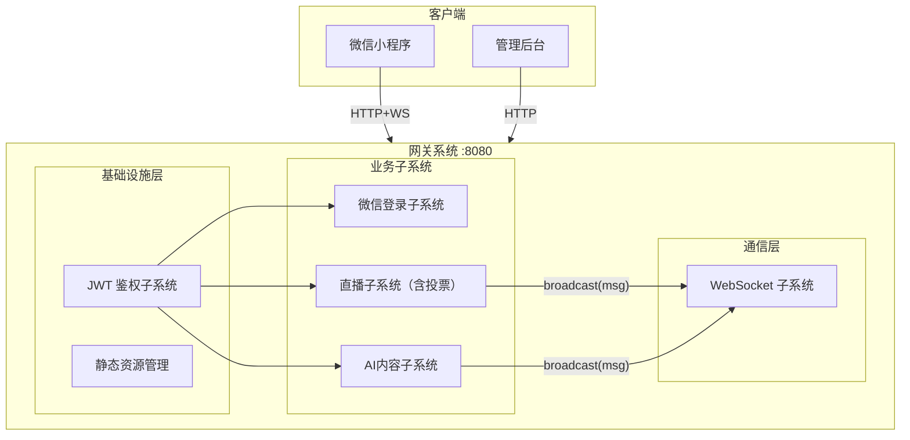
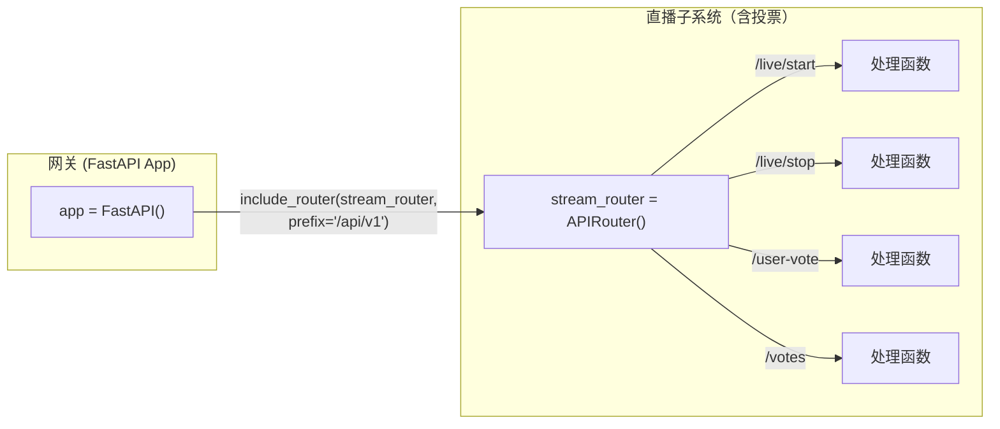
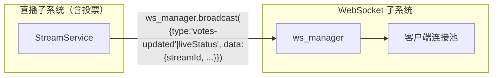
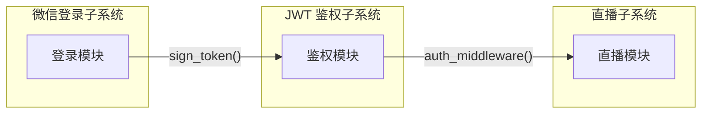

# 网关重构设计 v3

> 版本: v3.0
> 日期: 2026-03-24

## 1. 设计目标

| 目标 | 说明 |
|------|------|
| 单进程 | 所有功能在同一进程 |
| 分层架构 | 系统 → 子系统 → 模块 → 构件 |
| 解耦 | 子系统间通过接口通信，不直接依赖 |

---

## 2. 系统架构图



---

## 3. 层级结构

```
网关系统
├── 基础设施层
│   ├── JWT 鉴权
│   └── 静态资源管理
│
├── 业务子系统
│   ├── 直播子系统（含投票）
│   └── AI内容子系统
│
└── 通信层
    └── WebSocket 子系统
```

> 注：Blinker 是 WebSocket 子系统内部的实现细节，用于解耦业务子系统与 WebSocket 推送逻辑，不属于架构层级。

---

## 4. 子系统接口

### 4.1 业务子系统接入网关

FastAPI 提供 `APIRouter` + `include_router` 机制实现子系统接入：

| 概念 | 说明 |
|------|------|
| APIRouter | 子系统内部定义路由的容器 |
| include_router | 网关将子系统的路由挂载到指定前缀 |



**接入流程**：

1. 子系统创建 `APIRouter`，定义内部路由
2. 网关调用 `include_router(router, prefix=...)` 挂载
3. 请求到达网关后，按前缀分发到对应子系统

### 4.2 业务子系统接入 WebSocket

WebSocket 子系统提供 `broadcast()` 接口供业务子系统调用：

| 接口 | 参数 | 说明 |
|------|------|------|
| `broadcast(message)` | message: 推送内容 | 广播到所有已连接客户端 |



**接入流程**：

1. 业务子系统导入 `ws_manager` 实例
2. 业务完成后，调用 `ws_manager.broadcast(message)`，message 中包含 `data.streamId`
3. WebSocket 子系统将消息推送给所有已连接客户端
4. 客户端根据 `data.streamId` 自行过滤消息

### 4.3 业务子系统接入 JWT 鉴权

JWT 鉴权子系统提供以下接口供其他子系统调用：

| 接口 | 参数 | 调用者 | 说明 |
|------|------|--------|------|
| `sign_token(user_info)` | user_info: 用户信息 | 微信登录子系统 | 生成 JWT Token，返回给客户端 |
| `auth_middleware()` | - | 网关 | 注册为中间件，拦截请求验证 Token |
| `verify_token(token)` | token: JWT 字符串 | 中间件内部 | 验证 Token 有效性 |
| `inject_user(request, user_info)` | request, user_info | 中间件内部 | 注入用户信息到请求上下文 |



**接入流程**：

1. 请求到达网关，携带 `Authorization: Bearer <token>`
2. JWT 鉴权中间件拦截，验证 Token
3. 验证通过：解析用户信息，注入 `request.state.user`
4. 请求转发到业务子系统，处理函数从 `request.state.user` 获取用户身份

> 注：微信登录子系统登录 API 在白名单中，不被 JWT 中间件拦截。登录成功后调用 JWT 鉴权子系统的 `sign_token()` 生成 Token 返回给客户端。

---

## 5. 子系统职责

### 5.1 直播子系统（含投票）

| 构件 | 职责 |
|------|------|
| 路由 | 处理 `/api/v1/admin/live/*`、`/api/v1/admin/streams/*`、`/api/v1/votes/*`、`/api/v1/user-vote` |
| 服务 | 直播控制、流管理、投票逻辑、Dashboard 聚合 |
| 仓库 | 流配置、直播状态、辩题、投票数据 |

### 5.2 AI内容子系统

| 构件 | 职责 |
|------|------|
| 路由 | 处理 `/api/v1/ai-content/*`、`/api/v1/admin/ai/*` |
| 服务 | AI内容管理、识别控制 |
| 仓库 | 数据读写 |

---

## 6. 基础设施

### 6.1 JWT 鉴权子系统

| 职责 | 说明 |
|------|------|
| Token 分发 | 微信登录成功后，生成 JWT Token 返回给客户端 |
| Token 验证 | 请求进入业务子系统前，验证 Token 有效性 |
| 白名单 | `/api/wechat-login`、`/health`、`/admin`、`/ws` |
| 验证通过 | 解析用户信息，注入请求上下文 |
| 验证失败 | 返回 401 |

### 6.2 静态资源管理

| 职责 | 说明 |
|------|------|
| 注册表 | 集中管理所有静态目录的挂载路径与配置 |
| 解耦 | 静态资源挂载与网关主应用分离，新增挂载只改注册表 |
| 安全 | 目录不存在时自动跳过，不影响启动 |

### 6.3 日志工具

| 项目 | 说明 |
|------|------|
| 位置 | utils/logger/ |
| 方式 | 装饰器/中间件自动记录，业务代码无感知 |
| 输出 | 结构化 JSON，包含时间、模块、操作、耗时 |

---

## 7. 推送消息格式

业务子系统调用 `ws_manager.broadcast(message)` 时，message 格式：

| type | 发布者 | 用途 | data 字段 |
|------|--------|------|-----------|
| `votes-updated` | 直播子系统 | 票数变化 | `{streamId, leftVotes, rightVotes, totalVotes, leftPercentage, rightPercentage}` |
| `liveStatus` | 直播子系统 | 直播状态 | `{isLive, streamUrl, streamId, liveId}` |
| `newAIContent` | AI内容子系统 | 新AI内容 | `{id, content, timestamp, streamId}` |
| `aiStatus` | AI内容子系统 | AI识别状态 | `{status, streamId}` |

---

## 8. 项目结构

```
gateway/
├── app/
│   ├── main.py
│   │
│   ├── infra/                    # 基础设施层
│   │   ├── auth/                 # JWT 鉴权子系统
│   │   └── static/               # 静态资源管理
│   │
│   ├── utils/                    # 工具
│   │   └── logger/               # 日志工具
│   │
│   ├── subsystems/               # 业务子系统
│   │   ├── stream/               # 直播子系统（含投票）
│   │   └── ai_content/           # AI内容子系统
│   │
│   ├── comm/                     # 通信层
│   │   └── ws/                   # WebSocket 子系统
│
└── requirements.txt
```

---

## 9. 依赖

| 依赖 | 用途 |
|------|------|
| FastAPI | Web 框架 |
| Uvicorn | ASGI 服务器 |
| Blinker | 事件信号 |
| Pydantic | 数据验证 |
| python-jose | JWT |
| Loguru | 日志 |
| aiofiles | 异步文件 IO（StaticFiles 依赖） |

---

## 10. 启动

```bash
uvicorn app.main:app --host 0.0.0.0 --port 8080
```
