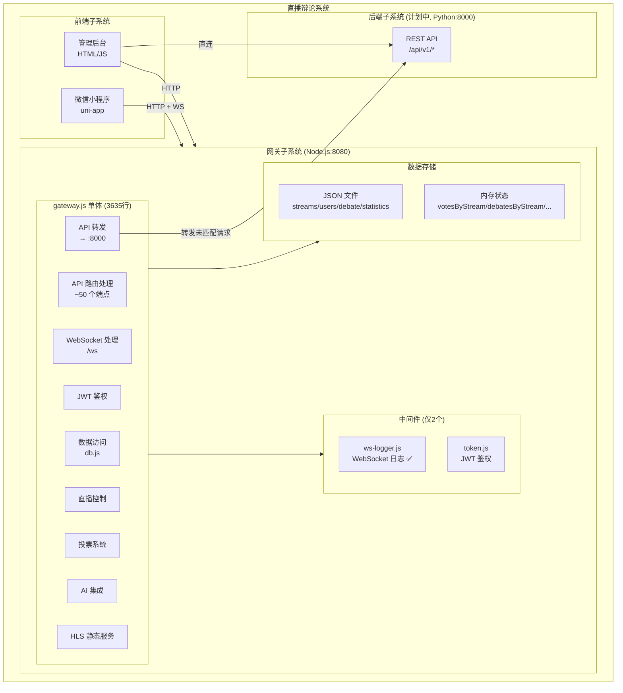
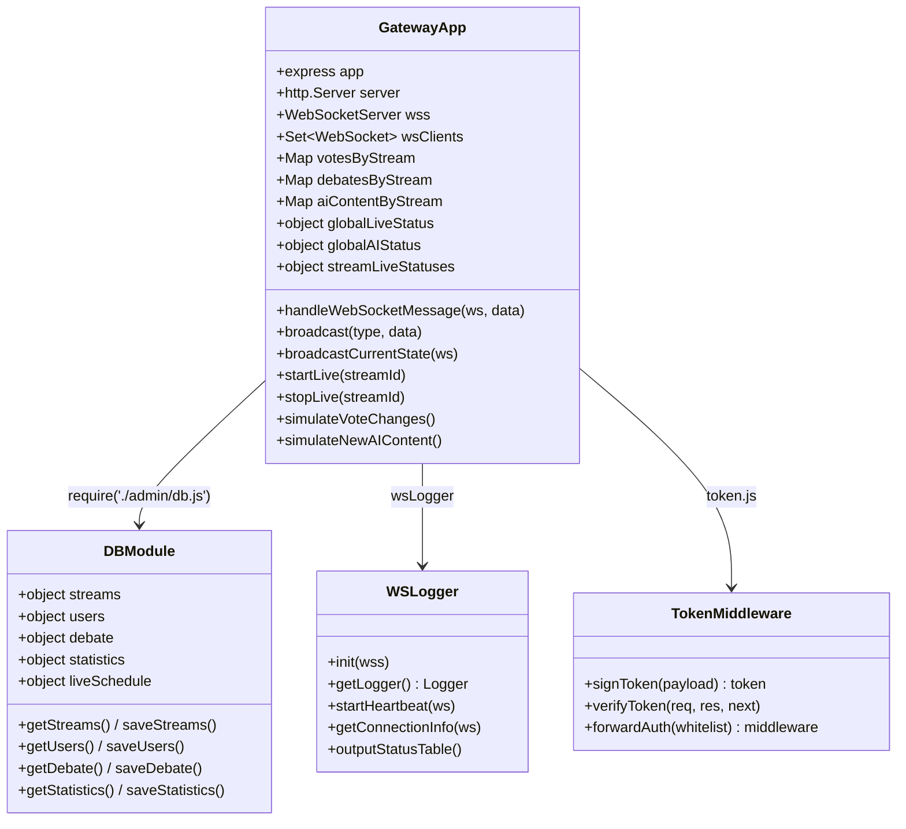
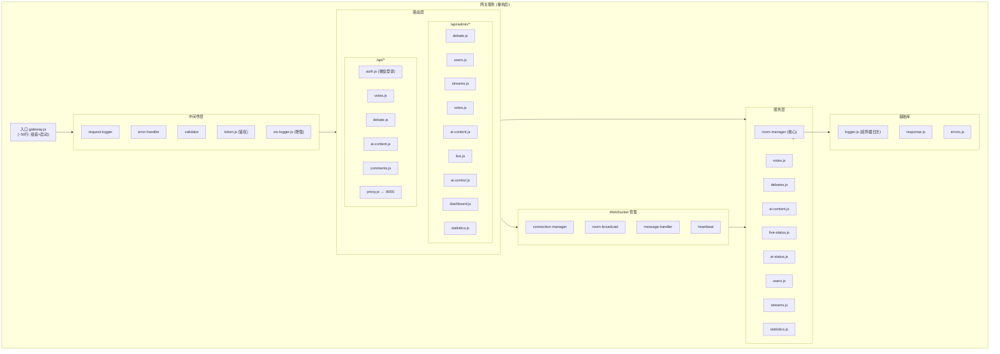
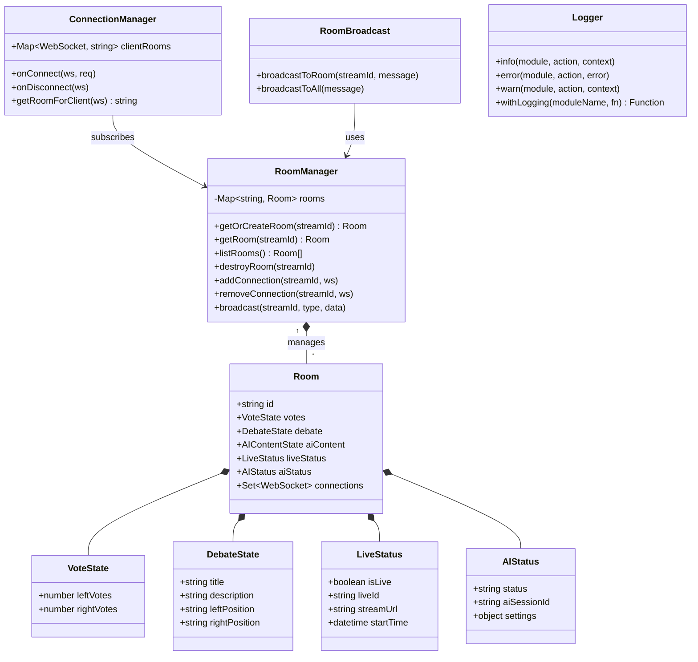

# 网关项目重构分析与计划 — 执行方案

## Context

当前网关项目 (`gateway/gateway.js`) 是一个 **3635行/108KB 的单体文件**，承载了 API 路由、WebSocket 管理、数据存储、鉴权、直播控制、投票系统、AI 集成等全部功能。项目存在两个核心问题：

1. **多直播间隔离失败**：尝试用内存 Map 实现数据隔离，但 WebSocket 广播到所有客户端、直播状态是全局的，隔离不彻底
2. **日志混乱**：gateway.js 中散布 111 处 `console.log/error/warn`，业务代码与日志代码高度耦合

## 本次要做什么

本次任务**只产出分析和计划文档**，不涉及任何代码修改。具体产出：

| # | 产出文件 | 内容 |
|---|---------|------|
| 1 | `gateway/docs/refactor-analysis.md` | 完整分析文档：现有代码分析 + 架构图(Mermaid) + 重构计划 + Git 策略 + 多房间方案 + 日志系统设计 |
| 2 | `gateway/docs/API分析文档.md` | 复制 `Project/API分析文档.md` 作为参考 |

---

## 产出物 1：`gateway/docs/refactor-analysis.md` 内容结构

### 第一部分：现有系统分析

#### 1.1 代码度量

| 指标 | 数值 | 评估 |
|------|------|------|
| gateway.js 行数 | 3,635 | 严重超标 |
| gateway.js 大小 | 108 KB | 不可维护 |
| API 端点数 | ~50 个路由注册 | 高复杂度 |
| console.log/error/warn 调用 | 111 处 | 日志混乱 |
| 内存状态存储 | 6 个（votesByStream, debatesByStream 等） | 高耦合风险 |
| 外部模块 | 2 个（ws-logger.js, token.js） | 几乎无拆分 |

#### 1.2 已发现的缺陷

| # | 缺陷 | 严重程度 | 位置 |
|---|------|---------|------|
| 1 | `aiDebateContent` 变量未声明 | 严重 | gateway.js:906 等 22 处引用 |
| 2 | 双重直播状态模型不同步 | 高 | `globalLiveStatus` vs `streamLiveStatuses` |
| 3 | WebSocket 广播无房间过滤 | 高 | broadcast() 函数 |
| 4 | db 模块多处重复导入 | 低 | gateway.js:224, 148, 366, 438 等 |
| 5 | 5+ 对重复 API 实现 | 中 | `/api/` 和 `/api/v1/` 同功能双版本 |
| 6 | 日志中间件位置错误 | 中 | 仅覆盖部分路由 |

### 第二部分：现有架构 Mermaid 图

用 Mermaid 绘制**当前系统**的架构 → 子系统 → 模块 → 构件分解：



#### 构件（类/对象）级别分解



### 第三部分：目标架构设计（重构后）



#### 目标构件（类）分解



### 第四部分：重构计划

#### 阶段 1：分析与文档化

| 步骤 | 内容 | 产出 |
|------|------|------|
| 1.1 | API 表面映射 | 验证已有 API 文档 |
| 1.2 | 数据流图 | 映射状态 → 读写端点 |
| 1.3 | WS 消息目录 | 生产者/消费者/房间行为 |
| 1.4 | 缺陷登记 | 6 个已发现缺陷 |

#### 阶段 2：架构设计

产出本分析文档中的目标架构。

#### 阶段 3：增量重构（12 步）

**3A 基础提取（不改变行为）**

| 步骤 | 操作 | 说明 |
|------|------|------|
| 1 | 提取日志系统 | 替换 111 处 console 调用 |
| 2 | 提取配置模块 | 合并分散的配置 |
| 3 | 提取数据访问层 | 创建 services/ 目录 |
| 4 | 提取路由模块 | 创建 routes/ 目录 |
| 5 | 合并重复端点 | `/api/` 和 `/api/v1/` 统一 |

**3B 多房间实现（改变行为）**

| 步骤 | 操作 | 说明 |
|------|------|------|
| 6 | Room Manager | 房间生命周期管理 |
| 7 | WS 房间订阅 | 按房间隔离广播 |
| 8 | 每房间直播状态 | 移除 globalLiveStatus |
| 9 | 每房间 AI 状态 | 移除 globalAIStatus |

**3C 横切关注点**

| 步骤 | 操作 | 说明 |
|------|------|------|
| 10 | 统一错误处理 | 集中化 error-handler |
| 11 | 统一输入验证 | validator 中间件 |
| 12 | 结构化请求日志 | 替换内联日志中间件 |

#### 阶段 4：测试与验证

- API 端点集成测试
- WebSocket 房间隔离测试
- 多房间并发测试
- 每步回归测试

#### 阶段 5：部署与迁移

- 备份 JSON 数据
- 灰度部署
- 监控 + 回退方案

### 第五部分：Git 版本控制策略

**推荐：新建 `refactor/architecture-redesign` 分支**

```
main (保持不动)
  └── refactor/architecture-redesign
        ├── feat/logging-system
        ├── feat/config-consolidation
        ├── feat/service-extraction
        ├── feat/route-modularization
        ├── feat/room-manager
        ├── feat/ws-room-subscription
        ├── feat/per-room-state
        └── feat/error-handling
```

| 考虑因素 | 新分支 ✅ | 新仓库 ❌ |
|---------|:------:|:------:|
| 保留演进历史 | 有 | 无 |
| 可随时回退 | `git revert` 单步 commit | 不方便 |
| 共享资源 | admin/data 自然共享 | 需 submodule |
| 代码可复用 | 核心逻辑可提取 | 需全部重写 |

**不推荐新仓库**：问题出在架构结构（单体、职责混杂），不是算法逻辑（投票、辩题、直播控制逻辑正确）。重构 = 拆分重组，不是推倒重来。

### 第六部分：多房间方案

**问题根因**：`wsClients` 是扁平 Set → 广播到所有人；`globalLiveStatus` 是单一对象 → 所有房间共享状态。

**方案**：Room Manager 模式

```
Room {
    id: streamId
    votes, debate, aiContent, liveStatus, aiStatus  // 全部状态
    connections: Set<WebSocket>                      // 独立客户端列表
}
```

WS 协议变更：
```
ws://server/ws?streamId=room-123  → 加入 room-123（只收该房间消息）
ws://server/ws                     → 加入 "default"（向后兼容）
```

### 第七部分：日志系统设计

**核心原则**：业务代码零日志代码，通过装饰器/中间件自动注入。

三种装饰模式：
1. **函数包装**：`addVotes = withLogging("VotesService", rawAddVotes)`
2. **中间件装饰**：`router.use(logRoute("PublicVotes"))`
3. **类方法装饰**：`@logMethods class VotesService { ... }`

迁移映射：
- 路由处理器中的 111 处 console → `logRoute()` 中间件
- 服务函数中的 console → `withLogging()` 包装器
- catch 中的 console.error → 错误处理中间件自动捕获
- 参考蓝本：`middleware/ws-logger.js`（已演示包装模式）

### 第八部分：风险与回退

| 风险 | 缓解 |
|------|------|
| 破坏 API 契约 | 重构前写集成测试 |
| WebSocket 不稳定 | 真实小程序验证 |
| 前端不兼容 | 保持 default 房间向后兼容 |

回退：每步独立 commit → `git revert` 单步；main 不动 → 整体回退只需 revert 合并 commit。

---

## 产出物 2：复制 API 分析文档

将 `D:\Source\Python\task\demo2\Project\API分析文档.md` 复制到 `gateway/docs/API分析文档.md`。

---

## 执行步骤

1. 创建 `gateway/docs/` 目录（如不存在）
2. 复制 `API分析文档.md` 到 `gateway/docs/API分析文档.md`
3. 创建 `gateway/docs/refactor-analysis.md`，内容为上述"第一部分"到"第八部分"的完整文档
