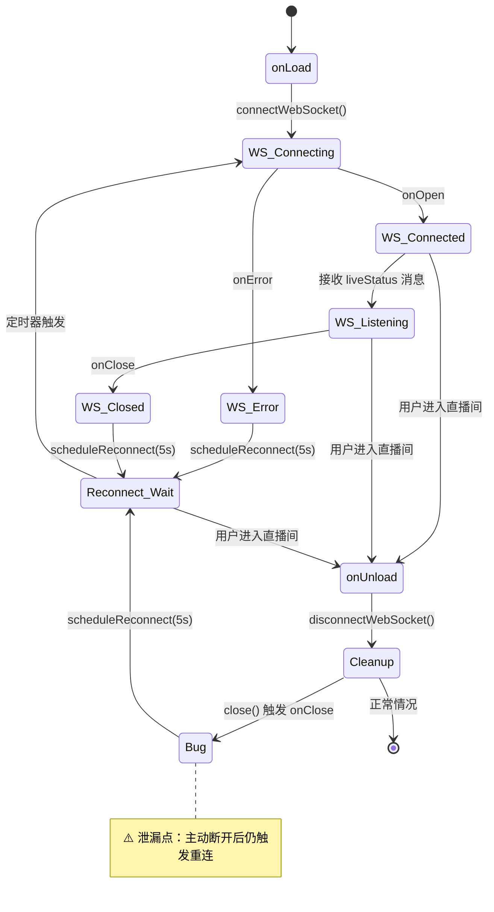
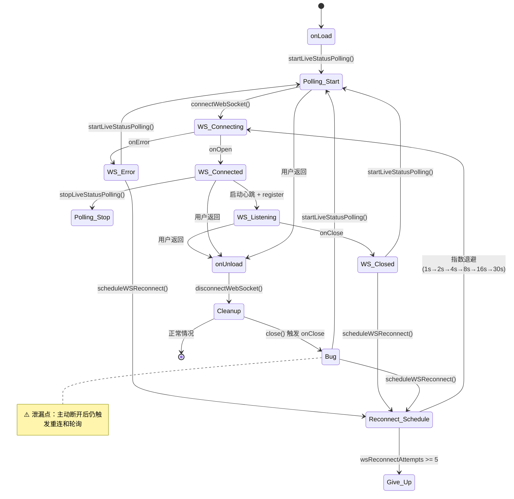
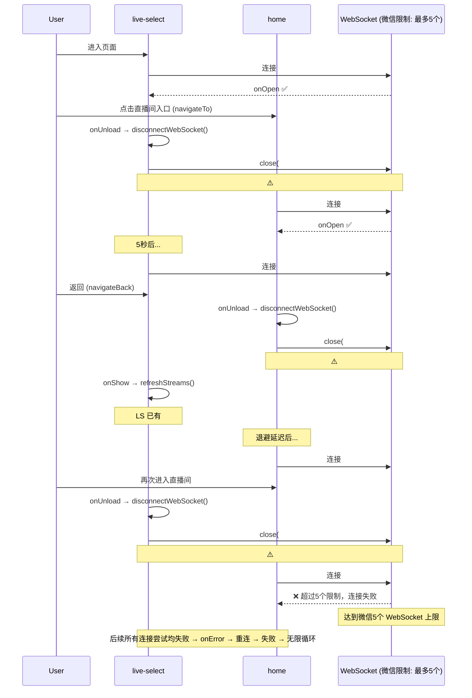
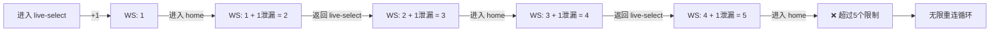

# 小程序端 WebSocket 行为分析

## 1. 涉及页面

| 页面 | 文件 | WebSocket 用途 |
|------|------|---------------|
| 直播选择页 | `live-select.vue` | 监听直播状态变更，实时刷新列表 |
| 直播间页 | `home.vue` | 接收投票数据、AI 内容、直播状态等实时推送 |

## 2. 页面生命周期中的 WebSocket 行为

### 2.1 live-select.vue



**关键代码路径：**

```
onLoad → connectWebSocket()
  → uni.connectSocket()
  → onError → scheduleReconnect()  ← 无论何种错误都重连
  → onClose → scheduleReconnect()  ← 无论何种关闭都重连（包括主动关闭）

onUnload → disconnectWebSocket()
  → clearTimeout(reconnectTimer)   ← 清除重连定时器
  → wsConnection.close()           ← 异步关闭
  → onClose 触发                    ← close() 是异步的，onClose 仍会触发
  → scheduleReconnect()            ← ⚠️ 此时 reconnectTimer 已为 null，创建新定时器
  → 5秒后 connectWebSocket()       ← ⚠️ 页面已卸载，但新连接仍被创建
```

### 2.2 home.vue



**关键代码路径：**

```
onLoad → startLiveStatusPolling()    ← 启动5秒轮询
       → connectWebSocket()
         → onOpen → stopLiveStatusPolling() + 启动心跳
         → onClose → startLiveStatusPolling() + scheduleWSReconnect()
         → onError → startLiveStatusPolling() + scheduleWSReconnect()

onUnload → disconnectWebSocket()
  → socketTask.close()               ← 异步关闭
  → stopWSHeartbeat()
  → clearTimeout(wsReconnectTimer)
  → onClose 触发                     ← ⚠️ close() 是异步的
  → startLiveStatusPolling()         ← ⚠️ 页面已卸载，轮询仍在运行
  → scheduleWSReconnect()            ← ⚠️ wsReconnectTimer 已清空，创建新定时器
```

## 3. 页面导航时的连接累积过程



## 4. 已知问题汇总

### 问题 1：主动断开触发重连（两个页面均存在）

**根因：** `disconnectWebSocket()` 调用 `socketTask.close()`，`close()` 是异步操作，会触发 `onClose` 回调。`onClose` 中无条件调用重连逻辑，而此时页面已卸载或正在卸载。

**影响：** 每次页面切换都泄漏一个 WebSocket 连接和一个重连定时器。

### 问题 2：home.vue 断开后轮询仍在运行

**根因：** `onClose` 回调中调用了 `startLiveStatusPolling()`，而 `onUnload` 中没有调用 `stopLiveStatusPolling()`。

**影响：** 页面卸载后，5秒轮询定时器仍在运行，持续发送无意义的 HTTP 请求。

### 问题 3：live-select.vue 无重连上限

**根因：** `scheduleReconnect()` 没有最大重连次数限制，会无限重试。

**影响：** 即使页面已卸载，重连定时器会无限创建新连接。

**对比：** home.vue 有 `wsMaxReconnectAttempts: 5` 的限制，但同样受问题 1 影响。

### 问题 4：home.vue 的 onUnload 未清理轮询

**代码位置：** `home.vue:817-851`

`onUnload` 清理了以下定时器：
- `recognitionTimer`
- `topBarSimulationTimer`
- `topBarUpdateTimer`
- `effectTimeouts`
- `fetchVoteDataTimeout`
- `wsReconnectTimer`

**未清理：**
- `liveStatusPollingTimer`（5秒轮询定时器）

## 5. 连接数量增长模型



每次页面切换（live-select ↔ home）净增 1 个泄漏连接。经过 4-5 次切换后达到微信小程序 5 个 WebSocket 并发上限，之后所有连接请求失败并进入无限重连循环。

## 6. 两个页面 WebSocket 实现对比

| 特性 | live-select.vue | home.vue |
|------|-----------------|----------|
| 连接时机 | `onLoad` | `onLoad` |
| 断开时机 | `onUnload` | `onUnload` |
| 重连策略 | 固定 5 秒 | 指数退避 (1s~30s) |
| 重连上限 | 无 | 5 次 |
| 心跳机制 | 无 | 有 (ping/pong) |
| 轮询降级 | 无 | 有 (5秒 HTTP 轮询) |
| 主动断开防重连 | 无 | 无 |
| onUnload 清理轮询 | N/A | 无（遗漏） |
| 消息过滤 | 无（处理所有消息） | 按 streamId 过滤 |
