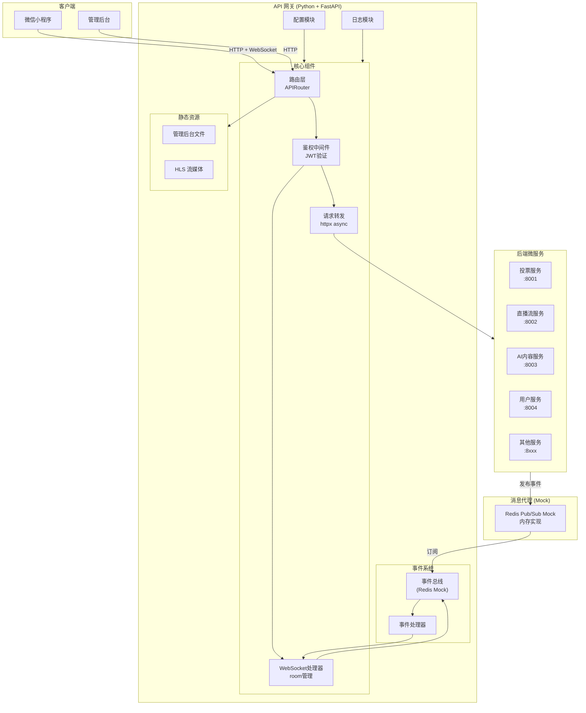
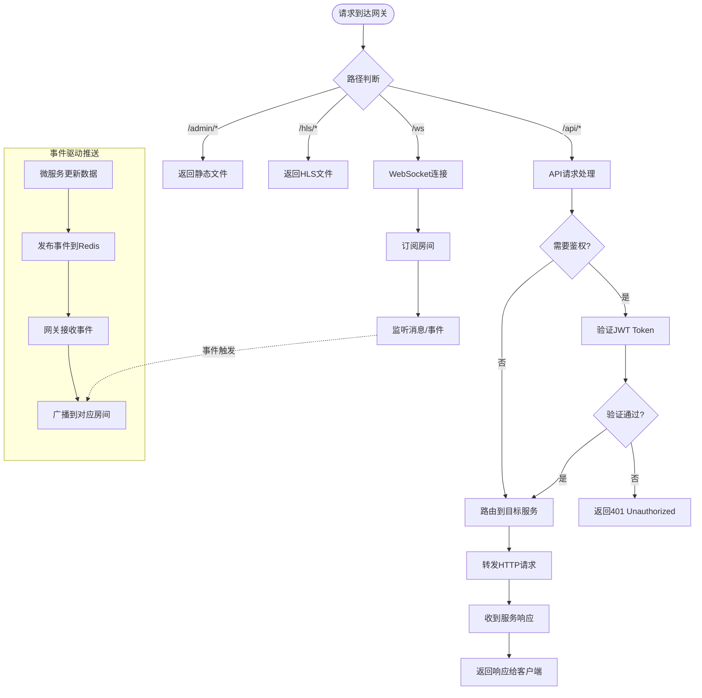
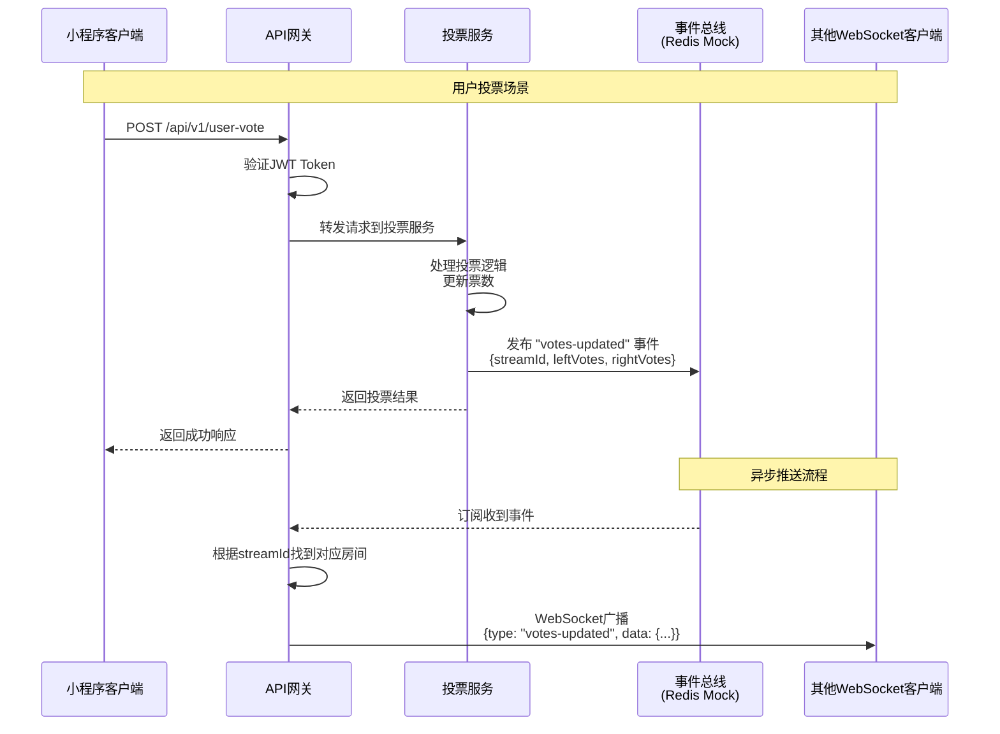
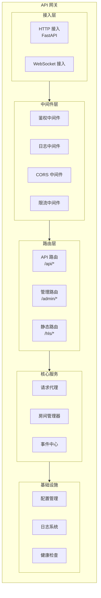
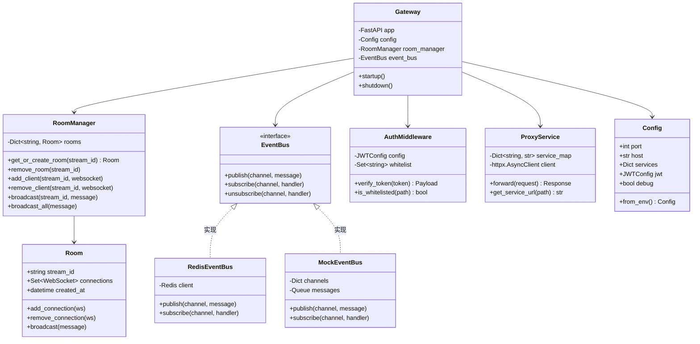
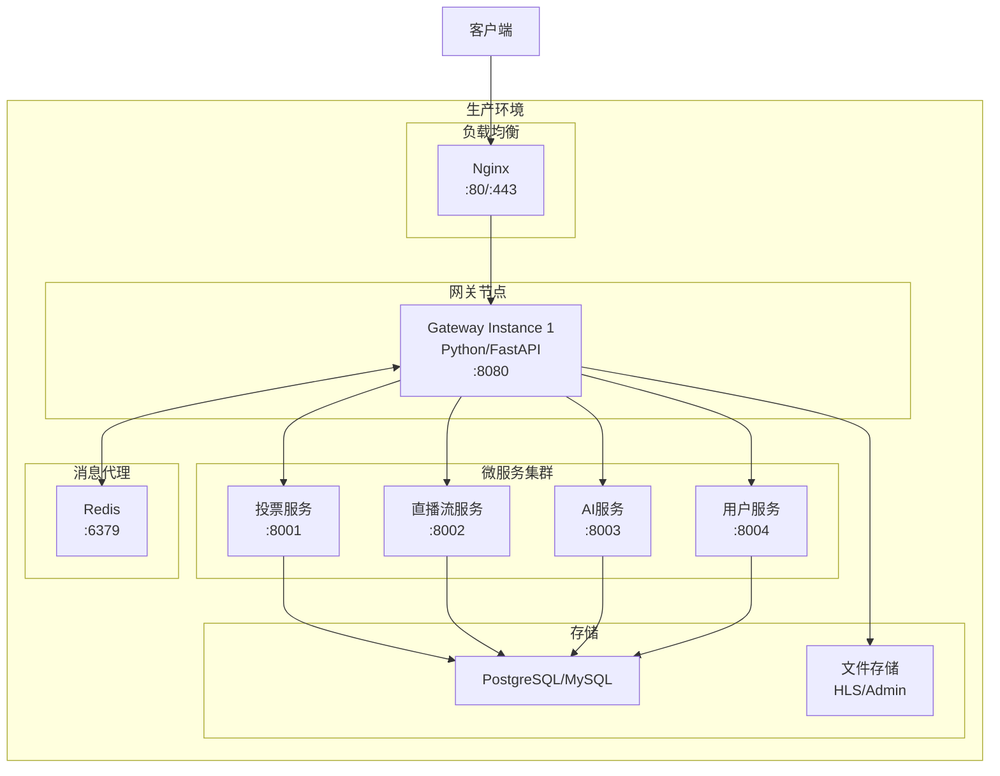
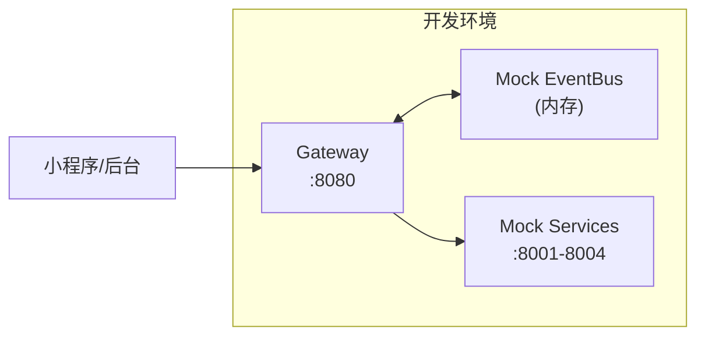
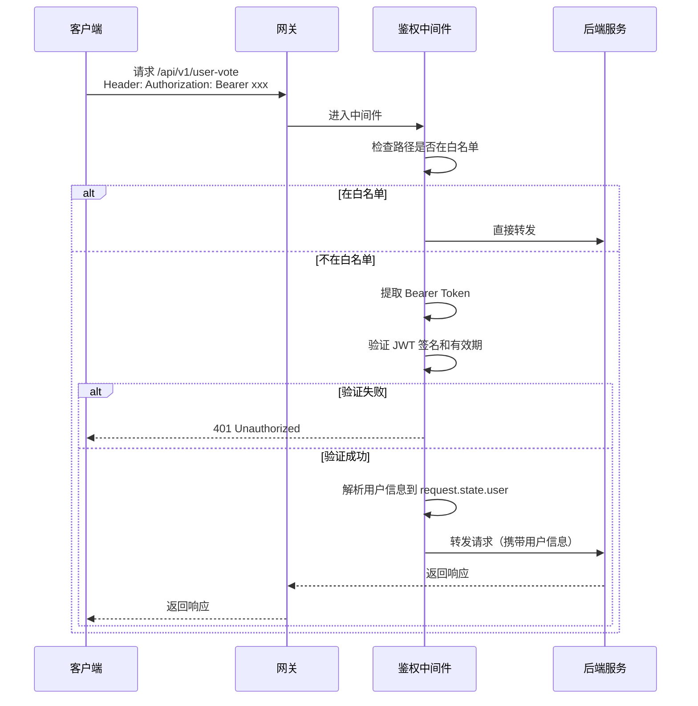
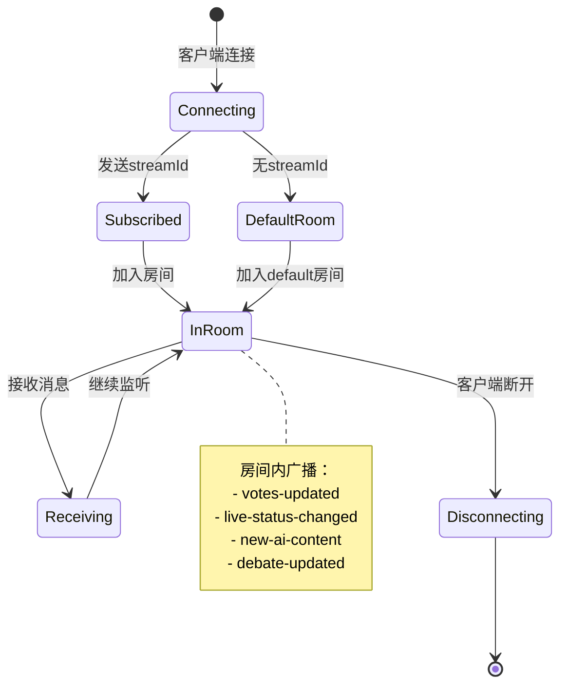

# 网关架构设计文档

> 版本: v1.0
> 日期: 2026-03-24
> 技术栈: Python + FastAPI

## 1. 设计概述

### 1.1 设计目标

将原单体网关（3635行 Node.js）重构为**微服务架构下的 API 网关**，实现：

| 目标 | 说明 |
|------|------|
| 请求路由 | 根据不同 API 路径，将请求转发到对应的后端微服务 |
| 统一鉴权 | 网关层统一处理 JWT 鉴权，只有通过鉴权的请求才能转发 |
| WebSocket 推送 | 支持实时数据推送，通过事件驱动机制响应后端服务的数据变更 |
| 静态资源 | 托管管理后台页面、HLS 流媒体文件 |
| 服务无关 | 网关不关心具体业务逻辑，任何微服务都能接入 |

### 1.2 核心设计决策

| 决策 | 选择 | 理由 |
|------|------|------|
| 技术栈 | Python + FastAPI | 与后端微服务统一技术栈；FastAPI 原生支持 async/await 和 WebSocket |
| WebSocket 部署 | 一体化部署 | 系统规模不需要独立扩展；一体化架构运维更简单 |
| 事件驱动 | Redis Pub/Sub (Mock) | 轻量级、低延迟；适合实时推送场景；Mock 实现便于开发测试 |
| 鉴权方式 | JWT | 与原系统兼容；无状态，适合微服务架构 |

---

## 2. 系统架构图

### 2.1 整体架构（UML 组件图）



### 2.2 请求处理流程（UML 活动图）



---

## 3. 事件驱动架构设计

### 3.1 问题：微服务下如何触发 WebSocket 推送？

**旧架构**：投票 API 在网关中实现，投票后直接调用 `broadcast()` 推送。

**新架构**：投票逻辑在独立的投票服务中，网关不知道何时应该推送。

**解决方案**：**事件驱动架构** + **发布/订阅模式**

### 3.2 事件流程（UML 序列图）



### 3.3 事件类型定义

| 事件类型 | 发布者 | 订阅者 | 数据结构 |
|---------|-------|-------|---------|
| `votes-updated` | 投票服务 | 网关 | `{streamId, leftVotes, rightVotes, totalVotes}` |
| `live-status-changed` | 直播流服务 | 网关 | `{streamId, isLive, streamUrl}` |
| `ai-status-changed` | AI服务 | 网关 | `{streamId, status}` |
| `new-ai-content` | AI服务 | 网关 | `{streamId, content}` |
| `debate-updated` | 辩题服务 | 网关 | `{streamId, debate}` |

### 3.4 Redis Mock 实现

```python
# 事件总线 Mock 实现（开发/测试环境使用）
class EventBusMock:
    """内存实现的发布/订阅，模拟 Redis Pub/Sub"""

    def __init__(self):
        self._channels: dict[str, list[Callable]] = {}
        self._messages: asyncio.Queue = asyncio.Queue()

    async def publish(self, channel: str, message: dict):
        """发布事件"""
        await self._messages.put((channel, message))

    async def subscribe(self, channel: str, handler: Callable):
        """订阅频道"""
        if channel not in self._channels:
            self._channels[channel] = []
        self._channels[channel].append(handler)

    async def start_listener(self):
        """启动事件监听循环"""
        while True:
            channel, message = await self._messages.get()
            if channel in self._channels:
                for handler in self._channels[channel]:
                    await handler(message)
```

---

## 4. 网关组件设计

### 4.1 组件图（UML 组件图）



### 4.2 类图（UML 类图）



---

## 5. 部署架构

### 5.1 部署图（UML 部署图）



### 5.2 开发环境部署



---

## 6. API 路由设计

### 6.1 路由表

| 前缀 | 处理方式 | 目标服务 | 鉴权 |
|------|---------|---------|------|
| `/ws` | WebSocket 本地处理 | - | 可选 |
| `/admin/*` | 静态文件服务 | - | 否 |
| `/hls/*` | 静态文件服务 | - | 否 |
| `/api/v1/user-vote` | 转发 | 投票服务:8001 | 是 |
| `/api/v1/votes` | 转发 | 投票服务:8001 | 是 |
| `/api/v1/admin/streams` | 转发 | 直播流服务:8002 | 否 |
| `/api/v1/admin/ai-content` | 转发 | AI服务:8003 | 否 |
| `/api/v1/admin/users` | 转发 | 用户服务:8004 | 否 |
| `/api/v1/*` | 转发（通配） | 配置的服务 | 按白名单 |
| `/api/wechat-login` | 转发 | 用户服务:8004 | 否 |
| `/health` | 本地处理 | - | 否 |

### 6.2 服务发现配置

```yaml
# config/services.yaml
services:
  vote:
    url: http://localhost:8001
    routes:
      - /api/v1/votes
      - /api/v1/user-vote
      - /api/v1/user-votes
      - /api/v1/admin/votes

  stream:
    url: http://localhost:8002
    routes:
      - /api/v1/admin/streams
      - /api/v1/admin/live
      - /api/v1/admin/rtmp

  ai:
    url: http://localhost:8003
    routes:
      - /api/v1/ai-content
      - /api/v1/admin/ai-content
      - /api/v1/admin/ai

  user:
    url: http://localhost:8004
    routes:
      - /api/v1/users
      - /api/v1/admin/users
      - /api/wechat-login

  default:
    url: http://localhost:8000
```

---

## 7. 鉴权设计

### 7.1 鉴权流程



### 7.2 鉴权白名单

```python
# 不需要鉴权的路径
AUTH_WHITELIST = {
    "/api/wechat-login",
    "/api/v1/wechat-login",
    "/health",
    "/admin",
    "/hls",
    "/ws",
    "/api/v1/admin/streams",      # 管理后台API，后续通过IP白名单控制
    "/api/v1/admin/live",
    "/api/v1/admin/ai-content",
    "/api/v1/admin/ai",
    "/api/v1/admin/dashboard",
}
```

---

## 8. WebSocket 设计

### 8.1 房间管理



### 8.2 WebSocket 消息协议

**客户端 → 服务端**

```json
{
    "type": "subscribe",
    "streamId": "stream-001"
}
```

**服务端 → 客户端**

```json
{
    "type": "connected",
    "message": "已连接到实时数据服务",
    "streamId": "stream-001"
}
```

```json
{
    "type": "votes-updated",
    "data": {
        "streamId": "stream-001",
        "leftVotes": 100,
        "rightVotes": 200,
        "leftPercentage": 33,
        "rightPercentage": 67,
        "totalVotes": 300
    },
    "timestamp": 1711267200000
}
```

---

## 9. 技术选型

| 组件 | 技术 | 版本 | 说明 |
|------|------|------|------|
| Web 框架 | FastAPI | ^0.100 | 高性能异步框架 |
| HTTP 客户端 | httpx | ^0.25 | 异步 HTTP 客户端，用于转发请求 |
| WebSocket | websockets | ^12.0 | 或使用 FastAPI 原生 WebSocket |
| JWT | python-jose | ^3.3 | JWT 编解码 |
| 配置管理 | pydantic-settings | ^2.0 | 类型安全的配置 |
| 日志 | loguru | ^0.7 | 结构化日志 |
| Redis 客户端 | redis | ^5.0 | 生产环境使用 |
| ASGI 服务器 | uvicorn | ^0.24 | 高性能 ASGI 服务器 |

---

## 10. 与旧架构对比

| 维度 | 旧架构 (Node.js) | 新架构 (Python + FastAPI) |
|------|-----------------|--------------------------|
| 代码行数 | 3635 行单体文件 | 模块化，每个文件 < 300 行 |
| 业务逻辑 | 网关内实现 | 转发到微服务 |
| 数据存储 | 网关内 JSON 文件 | 微服务独立数据库 |
| WebSocket 推送 | 直接调用 broadcast() | 事件驱动，订阅发布模式 |
| 鉴权 | 网关内 JWT 验证 | 网关内 JWT 验证（相同） |
| 静态资源 | 网关内托管 | 网关内托管（相同） |
| 扩展性 | 单体难以扩展 | 水平扩展微服务 |
| 日志 | 111 处 console.log | 结构化日志系统 |
