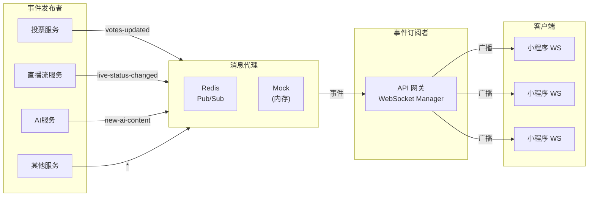
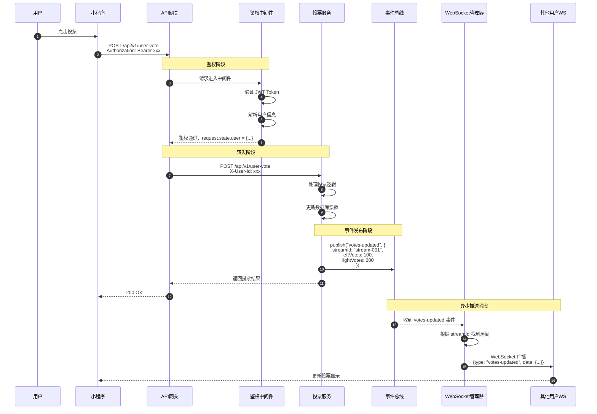
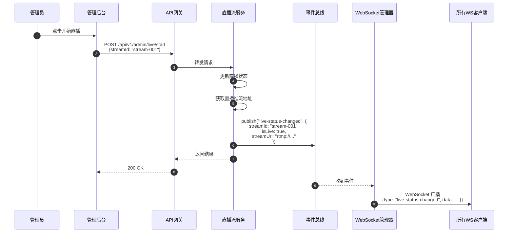
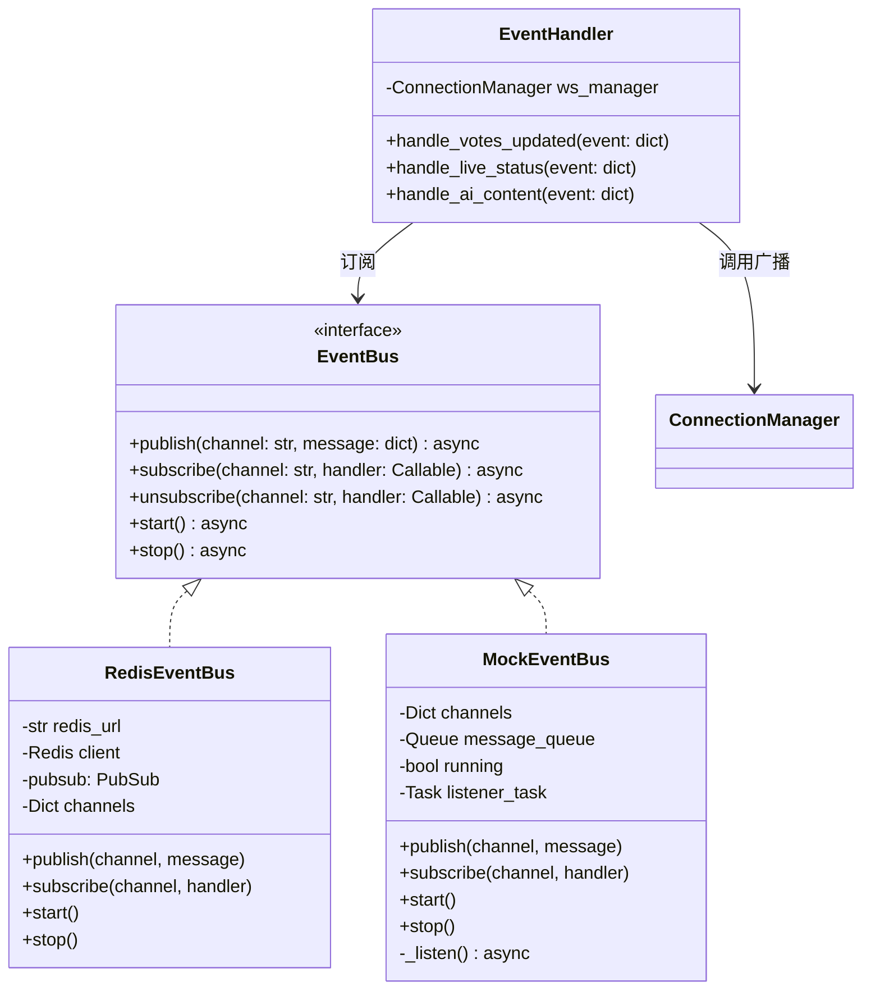

# 事件驱动架构设计

> 版本: v1.0
> 日期: 2026-03-24

## 1. 问题背景

### 1.1 旧架构的问题

```
┌─────────────────────────────────────────────────────────────┐
│                     旧架构 (单体网关)                          │
│                                                             │
│  ┌─────────────┐    ┌─────────────┐    ┌─────────────┐    │
│  │  投票 API   │───▶│  更新票数   │───▶│  broadcast() │    │
│  └─────────────┘    └─────────────┘    └─────────────┘    │
│                                                │            │
│                                                ▼            │
│                                    ┌──────────────────┐    │
│                                    │ WebSocket 客户端  │    │
│                                    └──────────────────┘    │
└─────────────────────────────────────────────────────────────┘

特点：投票逻辑和 WebSocket 推送在同一进程内，可以直接调用
```

### 1.2 新架构的挑战

```
┌──────────────────┐         ┌──────────────────┐
│    API 网关       │         │   投票微服务      │
│                  │         │                  │
│  - WebSocket     │    ?    │  - 投票逻辑      │
│  - 路由转发      │◀───────▶│  - 数据存储      │
│  - 鉴权          │         │                  │
└──────────────────┘         └──────────────────┘

问题：投票服务更新数据后，如何通知网关进行 WebSocket 推送？
```

### 1.3 解决方案：发布/订阅模式

```
┌──────────────────┐         ┌──────────────────┐         ┌──────────────────┐
│    API 网关       │         │   消息代理        │         │   投票微服务      │
│                  │         │  (Redis/Mock)    │         │                  │
│  - WebSocket     │◀────────│                  │◀────────│  - 投票逻辑      │
│  - 订阅事件      │  订阅   │  - Pub/Sub       │  发布   │  - 更新数据      │
│                  │         │                  │         │  - 发布事件      │
└──────────────────┘         └──────────────────┘         └──────────────────┘
```

---

## 2. 事件驱动架构设计

### 2.1 整体架构



### 2.2 事件类型定义

| 事件类型 | 发布者 | 触发条件 | 数据结构 |
|---------|-------|---------|---------|
| `votes-updated` | 投票服务 | 用户投票、管理员修改票数 | `{streamId, leftVotes, rightVotes, totalVotes}` |
| `live-status-changed` | 直播流服务 | 开始/停止直播 | `{streamId, isLive, streamUrl, liveId}` |
| `ai-status-changed` | AI服务 | 启动/停止/暂停AI | `{streamId, status, aiSessionId}` |
| `new-ai-content` | AI服务 | AI识别生成新内容 | `{streamId, content: {...}}` |
| `debate-updated` | 辩题服务 | 更新辩题 | `{streamId, debate: {...}}` |

### 2.3 事件数据格式

```json
{
    "event": "votes-updated",
    "timestamp": 1711267200000,
    "data": {
        "streamId": "stream-001",
        "leftVotes": 100,
        "rightVotes": 200,
        "leftPercentage": 33.33,
        "rightPercentage": 66.67,
        "totalVotes": 300
    }
}
```

---

## 3. 序列图：完整投票流程

### 3.1 投票触发 WebSocket 推送



### 3.2 直播状态变更



---

## 4. 组件设计

### 4.1 事件总线接口



### 4.2 事件处理器

```python
# app/events/handlers.py

from app.websocket.manager import ws_manager

class EventHandler:
    """事件处理器：将事件转换为 WebSocket 消息"""

    def __init__(self):
        self.ws_manager = ws_manager

    async def handle_votes_updated(self, event: dict):
        """处理投票更新事件"""
        data = event.get("data", {})
        stream_id = data.get("streamId", "default")

        message = {
            "type": "votes-updated",
            "data": data,
            "timestamp": event.get("timestamp")
        }

        await self.ws_manager.broadcast_to_room(stream_id, message)

    async def handle_live_status_changed(self, event: dict):
        """处理直播状态变更事件"""
        data = event.get("data", {})
        stream_id = data.get("streamId", "default")

        message = {
            "type": "live-status-changed",
            "data": data,
            "timestamp": event.get("timestamp")
        }

        # 直播状态变更广播到所有客户端
        await self.ws_manager.broadcast_all(message)

    async def handle_new_ai_content(self, event: dict):
        """处理新AI内容事件"""
        data = event.get("data", {})
        stream_id = data.get("streamId", "default")

        message = {
            "type": "new-ai-content",
            "data": data,
            "timestamp": event.get("timestamp")
        }

        await self.ws_manager.broadcast_to_room(stream_id, message)

# 事件类型到处理器的映射
EVENT_HANDLERS = {
    "votes-updated": EventHandler().handle_votes_updated,
    "live-status-changed": EventHandler().handle_live_status_changed,
    "ai-status-changed": EventHandler().handle_ai_status_changed,
    "new-ai-content": EventHandler().handle_new_ai_content,
    "debate-updated": EventHandler().handle_debate_updated,
}
```

### 4.3 事件总线初始化

```python
# app/events/bus.py

from app.events.handlers import EVENT_HANDLERS

async def setup_event_bus():
    """初始化事件总线并注册处理器"""
    bus = get_event_bus()

    # 订阅所有事件类型
    for event_type, handler in EVENT_HANDLERS.items():
        await bus.subscribe(event_type, handler)

    await bus.start()
    return bus
```

---

## 5. Mock 实现详解

### 5.1 为什么需要 Mock

| 场景 | 使用 Mock | 使用 Redis |
|------|----------|-----------|
| 本地开发 | 简单，无需额外依赖 | 需要启动 Redis |
| 单元测试 | 快速，可验证逻辑 | 需要测试容器 |
| CI/CD | 无需额外服务 | 需要 Redis 服务 |
| 生产环境 | **不适用** | **必须** |
| 多实例部署 | **不适用**（无法跨进程） | **必须** |

### 5.2 Mock 实现代码

```python
# app/events/mock_bus.py

import asyncio
from typing import Callable, Dict, List, Any
from app.events.bus import EventBus
from app.utils.logger import logger

class MockEventBus(EventBus):
    """
    内存实现的发布/订阅

    特点：
    - 纯内存，无外部依赖
    - 异步处理，不阻塞发布者
    - 支持多频道订阅
    - 适合开发和单机测试

    限制：
    - 不能跨进程通信
    - 重启后消息丢失
    - 不支持消息持久化
    """

    def __init__(self):
        self._channels: Dict[str, List[Callable]] = {}
        self._message_queue: asyncio.Queue = asyncio.Queue()
        self._running: bool = False
        self._listener_task: asyncio.Task = None

    async def publish(self, channel: str, message: Dict[str, Any]) -> None:
        """发布事件到指定频道"""
        logger.debug(f"[MockEventBus] Publishing to '{channel}': {message}")
        await self._message_queue.put((channel, message))

    async def subscribe(self, channel: str, handler: Callable) -> None:
        """订阅频道，注册事件处理器"""
        if channel not in self._channels:
            self._channels[channel] = []
        self._channels[channel].append(handler)
        logger.info(f"[MockEventBus] Subscribed to '{channel}'")

    async def unsubscribe(self, channel: str, handler: Callable = None) -> None:
        """取消订阅"""
        if channel in self._channels:
            if handler:
                self._channels[channel].remove(handler)
            else:
                del self._channels[channel]

    async def start(self) -> None:
        """启动事件监听循环"""
        if self._running:
            return

        self._running = True
        self._listener_task = asyncio.create_task(self._listen())
        logger.info("[MockEventBus] Started")

    async def stop(self) -> None:
        """停止事件监听"""
        self._running = False
        if self._listener_task:
            self._listener_task.cancel()
            try:
                await self._listener_task
            except asyncio.CancelledError:
                pass
        logger.info("[MockEventBus] Stopped")

    async def _listen(self) -> None:
        """内部：事件监听循环"""
        while self._running:
            try:
                # 带超时的获取，允许定期检查 running 状态
                channel, message = await asyncio.wait_for(
                    self._message_queue.get(),
                    timeout=1.0
                )

                # 分发到对应频道的处理器
                if channel in self._channels:
                    for handler in self._channels[channel]:
                        try:
                            await handler(message)
                        except Exception as e:
                            logger.error(
                                f"[MockEventBus] Handler error for '{channel}': {e}"
                            )

            except asyncio.TimeoutError:
                continue
            except asyncio.CancelledError:
                break
            except Exception as e:
                logger.error(f"[MockEventBus] Listener error: {e}")
```

### 5.3 Mock 使用示例

```python
# 测试代码示例

import pytest
from app.events.mock_bus import MockEventBus

@pytest.mark.asyncio
async def test_votes_updated_event():
    """测试投票更新事件"""
    bus = MockEventBus()
    received = []

    async def handler(message):
        received.append(message)

    await bus.subscribe("votes-updated", handler)
    await bus.start()

    # 发布事件
    await bus.publish("votes-updated", {
        "event": "votes-updated",
        "data": {"streamId": "test", "leftVotes": 10}
    })

    # 等待处理
    await asyncio.sleep(0.1)

    assert len(received) == 1
    assert received[0]["data"]["leftVotes"] == 10

    await bus.stop()
```

---

## 6. 微服务端发布事件

### 6.1 事件发布工具类

```python
# 微服务端使用的事件发布器
# 注意：这是在微服务中运行的代码，不是网关代码

import httpx
from datetime import datetime
from typing import Any

class EventPublisher:
    """事件发布器（微服务端使用）"""

    def __init__(self, gateway_url: str = "http://localhost:8080"):
        self.gateway_url = gateway_url
        self.client = httpx.AsyncClient()

    async def publish(self, event_type: str, data: dict) -> None:
        """
        发布事件

        方式一：通过 HTTP 调用网关的事件接口
        方式二：直接连接 Redis 发布（生产环境推荐）
        """
        payload = {
            "event": event_type,
            "timestamp": int(datetime.now().timestamp() * 1000),
            "data": data
        }

        # 方式一：HTTP 调用（简单，适合开发）
        await self.client.post(
            f"{self.gateway_url}/internal/events/publish",
            json=payload
        )

    async def publish_votes_updated(
        self,
        stream_id: str,
        left_votes: int,
        right_votes: int
    ):
        """发布投票更新事件"""
        await self.publish("votes-updated", {
            "streamId": stream_id,
            "leftVotes": left_votes,
            "rightVotes": right_votes,
            "totalVotes": left_votes + right_votes
        })
```

### 6.2 网关接收事件的 HTTP 接口

```python
# 网关端：接收微服务发布的事件
# app/api/internal.py

from fastapi import APIRouter, Request
from app.events.bus import get_event_bus

router = APIRouter(prefix="/internal", tags=["internal"])

@router.post("/events/publish")
async def receive_event(request: Request):
    """
    接收微服务发布的事件

    仅限内部调用，生产环境应通过 IP 白名单保护
    """
    event = await request.json()
    bus = get_event_bus()

    await bus.publish(event["event"], event)

    return {"success": True}
```

---

## 7. 与旧架构对比

| 维度 | 旧架构 | 新架构 |
|------|-------|-------|
| 推送触发 | 直接调用 `broadcast()` | 事件发布/订阅 |
| 耦合度 | 高（网关包含业务逻辑） | 低（网关只负责转发和推送） |
| 扩展性 | 单体难以扩展 | 微服务可独立扩展 |
| 可测试性 | 需要 Mock 整个网关 | 事件系统可独立测试 |
| 运维复杂度 | 低 | 中（需要消息代理） |
| 适用规模 | 小型应用 | 中大型应用 |

---

## 8. 切换指南

### 8.1 从 Mock 切换到 Redis

```python
# .env
USE_REDIS=true
REDIS_URL=redis://localhost:6379
```

```yaml
# docker-compose.yaml
services:
  redis:
    image: redis:7-alpine
    ports:
      - "6379:6379"
```

### 8.2 Redis 实现要点

```python
# app/events/redis_bus.py

import asyncio
import redis.asyncio as redis
from app.events.bus import EventBus

class RedisEventBus(EventBus):
    def __init__(self, redis_url: str):
        self.redis_url = redis_url
        self.client = None
        self.pubsub = None
        self.handlers = {}

    async def start(self):
        self.client = redis.from_url(self.redis_url)
        self.pubsub = self.client.pubsub()
        await self.pubsub.subscribe(*self.handlers.keys())
        asyncio.create_task(self._listen())

    async def _listen(self):
        async for message in self.pubsub.listen():
            if message["type"] == "message":
                channel = message["channel"]
                data = json.loads(message["data"])
                for handler in self.handlers.get(channel, []):
                    await handler(data)
```
