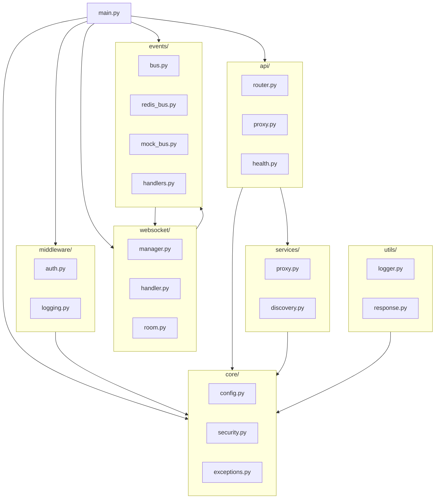

# 新网关项目结构

> 版本: v1.0
> 日期: 2026-03-24
> 技术栈: Python + FastAPI

## 1. 目录结构

```
live-gateway/
├── app/                          # 应用主目录
│   ├── __init__.py
│   ├── main.py                   # FastAPI 应用入口
│   │
│   ├── core/                     # 核心配置
│   │   ├── __init__.py
│   │   ├── config.py             # 配置管理（pydantic-settings）
│   │   ├── security.py           # JWT 相关
│   │   └── exceptions.py         # 自定义异常
│   │
│   ├── middleware/               # 中间件
│   │   ├── __init__.py
│   │   ├── auth.py               # JWT 鉴权中间件
│   │   ├── logging.py            # 请求日志中间件
│   │   ├── cors.py               # CORS 配置
│   │   └── rate_limit.py         # 限流中间件
│   │
│   ├── api/                      # API 路由
│   │   ├── __init__.py
│   │   ├── router.py             # 主路由聚合
│   │   ├── health.py             # 健康检查 /health
│   │   └── proxy.py              # 请求转发处理器
│   │
│   ├── websocket/                # WebSocket 模块
│   │   ├── __init__.py
│   │   ├── manager.py            # 连接管理器 / 房间管理
│   │   ├── room.py               # 房间类定义
│   │   ├── handler.py            # WebSocket 消息处理器
│   │   └── protocol.py           # 消息协议定义
│   │
│   ├── events/                   # 事件系统
│   │   ├── __init__.py
│   │   ├── bus.py                # 事件总线接口
│   │   ├── redis_bus.py          # Redis 实现（生产）
│   │   ├── mock_bus.py           # Mock 实现（开发/测试）
│   │   └── handlers.py           # 事件处理器
│   │
│   ├── services/                 # 外部服务客户端
│   │   ├── __init__.py
│   │   ├── proxy.py              # HTTP 请求转发服务
│   │   └── discovery.py          # 服务发现/路由配置
│   │
│   └── utils/                    # 工具函数
│       ├── __init__.py
│       ├── logger.py             # 日志配置
│       └── response.py           # 响应格式化
│
├── static/                       # 静态资源
│   ├── admin/                    # 管理后台页面
│   │   ├── index.html
│   │   ├── admin.js
│   │   ├── admin-api.js
│   │   └── ...
│   └── hls/                      # HLS 流媒体文件
│
├── config/                       # 配置文件
│   ├── services.yaml             # 微服务路由配置
│   ├── auth.yaml                 # 鉴权配置（白名单等）
│   └── logging.yaml              # 日志配置
│
├── tests/                        # 测试
│   ├── __init__.py
│   ├── conftest.py               # pytest 配置
│   ├── test_auth.py              # 鉴权测试
│   ├── test_websocket.py         # WebSocket 测试
│   ├── test_proxy.py             # 代理测试
│   └── test_events.py            # 事件系统测试
│
├── docs/                         # 文档
│   ├── architecture-design.md    # 架构设计（本文档的配套）
│   ├── project-structure.md      # 项目结构（本文件）
│   └── api-spec.md               # API 规格
│
├── scripts/                      # 脚本
│   ├── dev.sh                    # 开发启动
│   └── mock_services.py          # Mock 微服务（开发用）
│
├── .env.example                  # 环境变量示例
├── .gitignore
├── pyproject.toml                # 项目配置（poetry/pdm）
├── requirements.txt              # 依赖
├── Dockerfile                    # Docker 镜像
├── docker-compose.yaml           # 本地开发环境
└── README.md                     # 项目说明
```

---

## 2. 核心文件说明

### 2.1 `app/main.py` - 应用入口

```python
"""
API 网关入口文件
职责：
1. 创建 FastAPI 应用
2. 注册中间件
3. 注册路由
4. 启动事件监听
5. 生命周期管理
"""
from contextlib import asynccontextmanager
from fastapi import FastAPI
from app.core.config import settings
from app.middleware import setup_middlewares
from app.api.router import api_router
from app.websocket.manager import ws_manager
from app.events.bus import get_event_bus

@asynccontextmanager
async def lifespan(app: FastAPI):
    """应用生命周期管理"""
    # 启动时
    event_bus = get_event_bus()
    await event_bus.start()
    yield
    # 关闭时
    await event_bus.stop()

app = FastAPI(
    title="Live Debate Gateway",
    version="2.0.0",
    lifespan=lifespan
)

setup_middlewares(app)
app.include_router(api_router)
```

### 2.2 `app/core/config.py` - 配置管理

```python
"""
配置管理
使用 pydantic-settings 实现类型安全的配置
支持环境变量和 .env 文件
"""
from pydantic_settings import BaseSettings
from typing import Dict, Set

class Settings(BaseSettings):
    # 服务配置
    APP_NAME: str = "live-gateway"
    HOST: str = "0.0.0.0"
    PORT: int = 8080
    DEBUG: bool = False

    # JWT 配置
    JWT_SECRET: str = "your-secret-key"
    JWT_ALGORITHM: str = "HS256"
    JWT_EXPIRE_HOURS: int = 168  # 7天

    # 鉴权白名单
    AUTH_WHITELIST: Set[str] = {
        "/api/wechat-login",
        "/health",
        "/admin",
        "/hls",
        "/ws",
    }

    # 微服务配置
    SERVICES: Dict[str, str] = {
        "vote": "http://localhost:8001",
        "stream": "http://localhost:8002",
        "ai": "http://localhost:8003",
        "user": "http://localhost:8004",
        "default": "http://localhost:8000",
    }

    # Redis 配置（生产环境）
    REDIS_URL: str = "redis://localhost:6379"
    USE_REDIS: bool = False  # False 则使用 Mock

    class Config:
        env_file = ".env"
        env_file_encoding = "utf-8"

settings = Settings()
```

### 2.3 `app/middleware/auth.py` - 鉴权中间件

```python
"""
JWT 鉴权中间件
职责：
1. 检查请求路径是否在白名单
2. 验证 JWT Token
3. 解析用户信息到 request.state
"""
from fastapi import Request, HTTPException
from starlette.middleware.base import BaseHTTPMiddleware
from app.core.config import settings
from app.core.security import verify_token

class AuthMiddleware(BaseHTTPMiddleware):
    async def dispatch(self, request: Request, call_next):
        path = request.url.path

        # 检查白名单
        if self._is_whitelisted(path):
            return await call_next(request)

        # 提取 Token
        auth_header = request.headers.get("Authorization")
        if not auth_header or not auth_header.startswith("Bearer "):
            raise HTTPException(status_code=401, detail="Missing or invalid token")

        token = auth_header.split(" ")[1]

        # 验证 Token
        try:
            payload = verify_token(token)
            request.state.user = payload
        except Exception as e:
            raise HTTPException(status_code=401, detail=str(e))

        return await call_next(request)

    def _is_whitelisted(self, path: str) -> bool:
        return any(path.startswith(p) for p in settings.AUTH_WHITELIST)
```

### 2.4 `app/websocket/manager.py` - 房间管理器

```python
"""
WebSocket 房间管理器
职责：
1. 管理所有 WebSocket 连接
2. 按房间（streamId）分组
3. 提供广播接口
"""
from fastapi import WebSocket
from typing import Dict, Set
from app.websocket.room import Room

class ConnectionManager:
    def __init__(self):
        self._rooms: Dict[str, Room] = {}
        self._client_rooms: Dict[WebSocket, str] = {}

    def get_or_create_room(self, stream_id: str) -> Room:
        if stream_id not in self._rooms:
            self._rooms[stream_id] = Room(stream_id)
        return self._rooms[stream_id]

    async def connect(self, websocket: WebSocket, stream_id: str = "default"):
        await websocket.accept()
        room = self.get_or_create_room(stream_id)
        room.add_connection(websocket)
        self._client_rooms[websocket] = stream_id
        return room

    def disconnect(self, websocket: WebSocket):
        if websocket in self._client_rooms:
            stream_id = self._client_rooms[websocket]
            if stream_id in self._rooms:
                self._rooms[stream_id].remove_connection(websocket)
                # 房间为空时清理
                if self._rooms[stream_id].is_empty():
                    del self._rooms[stream_id]
            del self._client_rooms[websocket]

    async def broadcast_to_room(self, stream_id: str, message: dict):
        if stream_id in self._rooms:
            await self._rooms[stream_id].broadcast(message)

    async def broadcast_all(self, message: dict):
        for room in self._rooms.values():
            await room.broadcast(message)

ws_manager = ConnectionManager()
```

### 2.5 `app/events/bus.py` - 事件总线

```python
"""
事件总线抽象
支持 Redis 实现（生产）和 Mock 实现（开发）
"""
from abc import ABC, abstractmethod
from typing import Callable, Dict
from app.core.config import settings

class EventBus(ABC):
    @abstractmethod
    async def publish(self, channel: str, message: dict):
        """发布事件"""
        pass

    @abstractmethod
    async def subscribe(self, channel: str, handler: Callable):
        """订阅频道"""
        pass

    @abstractmethod
    async def start(self):
        """启动事件监听"""
        pass

    @abstractmethod
    async def stop(self):
        """停止事件监听"""
        pass

def get_event_bus() -> EventBus:
    """工厂函数：根据配置返回对应实现"""
    if settings.USE_REDIS:
        from app.events.redis_bus import RedisEventBus
        return RedisEventBus(settings.REDIS_URL)
    else:
        from app.events.mock_bus import MockEventBus
        return MockEventBus()
```

### 2.6 `app/events/mock_bus.py` - Mock 事件总线

```python
"""
内存实现的发布/订阅
用于开发和测试环境，模拟 Redis Pub/Sub 行为
"""
import asyncio
from typing import Callable, Dict, List
from app.events.bus import EventBus

class MockEventBus(EventBus):
    def __init__(self):
        self._channels: Dict[str, List[Callable]] = {}
        self._message_queue: asyncio.Queue = asyncio.Queue()
        self._running = False
        self._listener_task = None

    async def publish(self, channel: str, message: dict):
        await self._message_queue.put((channel, message))

    async def subscribe(self, channel: str, handler: Callable):
        if channel not in self._channels:
            self._channels[channel] = []
        self._channels[channel].append(handler)

    async def start(self):
        self._running = True
        self._listener_task = asyncio.create_task(self._listen())

    async def stop(self):
        self._running = False
        if self._listener_task:
            self._listener_task.cancel()

    async def _listen(self):
        while self._running:
            try:
                channel, message = await asyncio.wait_for(
                    self._message_queue.get(),
                    timeout=1.0
                )
                if channel in self._channels:
                    for handler in self._channels[channel]:
                        try:
                            await handler(message)
                        except Exception as e:
                            # 记录错误但不中断
                            print(f"Event handler error: {e}")
            except asyncio.TimeoutError:
                continue
```

### 2.7 `app/services/proxy.py` - 请求转发

```python
"""
HTTP 请求转发服务
职责：
1. 根据路径匹配目标服务
2. 转发请求并返回响应
"""
import httpx
from fastapi import Request
from app.core.config import settings
from app.services.discovery import get_service_url

class ProxyService:
    def __init__(self):
        self._client = httpx.AsyncClient(timeout=30.0)

    async def forward(self, request: Request) -> httpx.Response:
        # 获取目标服务 URL
        service_url = get_service_url(request.url.path)

        # 构建目标 URL
        target_url = f"{service_url}{request.url.path}"
        if request.url.query:
            target_url += f"?{request.url.query}"

        # 准备请求
        headers = dict(request.headers)
        headers.pop("host", None)  # 移除原 host

        # 添加用户信息（如果已鉴权）
        if hasattr(request.state, "user"):
            headers["X-User-Id"] = request.state.user.get("sub", "")

        # 发送请求
        body = await request.body()

        response = await self._client.request(
            method=request.method,
            url=target_url,
            headers=headers,
            content=body if body else None
        )

        return response

proxy_service = ProxyService()
```

---

## 3. 配置文件

### 3.1 `config/services.yaml` - 服务路由

```yaml
# 微服务路由配置
services:
  vote:
    url: http://localhost:8001
    routes:
      - /api/v1/votes
      - /api/v1/user-vote
      - /api/v1/user-votes
      - /api/v1/admin/votes
      - /api/v1/admin/votes/statistics

  stream:
    url: http://localhost:8002
    routes:
      - /api/v1/admin/streams
      - /api/v1/admin/live
      - /api/v1/admin/rtmp
      - /api/v1/admin/dashboard

  ai:
    url: http://localhost:8003
    routes:
      - /api/v1/ai-content
      - /api/v1/admin/ai-content
      - /api/v1/admin/ai

  user:
    url: http://localhost:8004
    routes:
      - /api/v1/users
      - /api/v1/admin/users
      - /api/v1/admin/miniprogram
      - /api/wechat-login

  # 默认转发目标
  default:
    url: http://localhost:8000
```

### 3.2 `.env.example` - 环境变量

```bash
# 应用配置
APP_NAME=live-gateway
HOST=0.0.0.0
PORT=8080
DEBUG=true

# JWT 配置
JWT_SECRET=your-jwt-secret-key-change-in-production
JWT_ALGORITHM=HS256
JWT_EXPIRE_HOURS=168

# Redis 配置
REDIS_URL=redis://localhost:6379
USE_REDIS=false

# 微服务地址（可覆盖 yaml 配置）
SERVICE_VOTE_URL=http://localhost:8001
SERVICE_STREAM_URL=http://localhost:8002
SERVICE_AI_URL=http://localhost:8003
SERVICE_USER_URL=http://localhost:8004
```

---

## 4. 依赖清单

### 4.1 `requirements.txt`

```
fastapi>=0.100.0
uvicorn[standard]>=0.24.0
httpx>=0.25.0
python-jose[cryptography]>=3.3.0
pydantic-settings>=2.0.0
pyyaml>=6.0
redis>=5.0.0
websockets>=12.0
loguru>=0.7.0

# 开发依赖
pytest>=7.4.0
pytest-asyncio>=0.21.0
httpx>=0.25.0
```

---

## 5. 模块依赖关系


