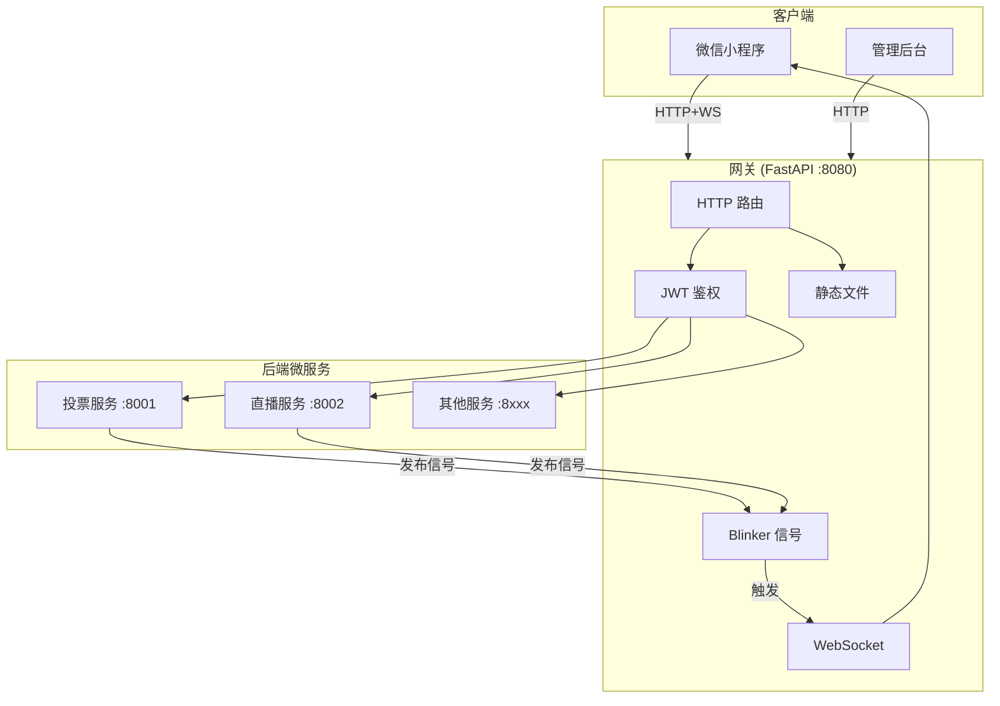
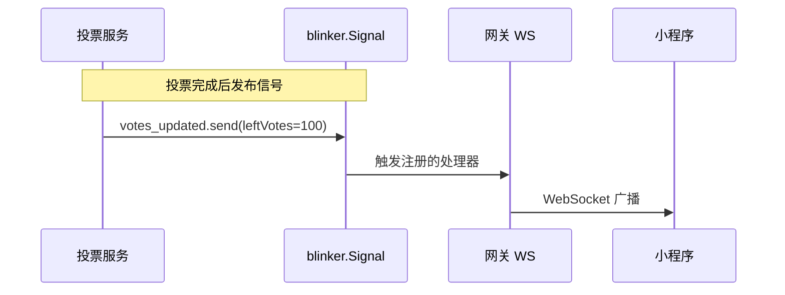

# 网关重构设计 v2（简化版）

> 版本: v2.0
> 日期: 2026-03-24
> 技术栈: Python + FastAPI + Blinker

## 设计原则

1. **简单优先** - 能用标准库就不用三方库，能用三方库就不自己造轮子
2. **最小依赖** - 只引入必要的依赖
3. **单体优先** - 不做过度设计，先跑起来再优化

## 与 v1 的区别

| 项目 | v1 设计 | v2 设计（简化） |
|------|--------|----------------|
| 部署 | Nginx + Uvicorn | 仅 Uvicorn |
| 事件系统 | Redis / Mock 二选一 | Blinker（Python 信号库） |
| 文档 | 4 个独立文件 | 1 个合并文件 |
| 复杂度 | 高（企业级） | 低（够用就好） |

---

## 1. 架构图



---

## 2. 事件系统：Blinker

### 为什么选 Blinker

- **标准选择** - Flask 官方使用的信号库
- **零配置** - 纯 Python，无需额外服务
- **轻量** - 单文件实现，约 200 行代码
- **同步/异步兼容** - 支持 async handler

### 工作原理



### 代码示例

```python
# app/events/signals.py
from blinker import Signal

# 定义信号
votes_updated = Signal("votes-updated")
live_status_changed = Signal("live-status-changed")
new_ai_content = Signal("new-ai-content")

# app/websocket/handler.py
from app.events.signals import votes_updated
from app.websocket.manager import ws_manager

# 订阅信号
@votes_updated.connect
async def on_votes_updated(sender, **kwargs):
    """收到投票更新信号后广播"""
    stream_id = kwargs.get("streamId", "default")
    await ws_manager.broadcast_to_room(stream_id, {
        "type": "votes-updated",
        "data": kwargs
    })

# 后端服务发布信号（投票服务调用）
# votes_updated.send("vote-service", streamId="room-1", leftVotes=100, rightVotes=200)
```

---

## 3. 项目结构（精简版）

```
gateway/
├── app/
│   ├── main.py              # 入口（约 50 行）
│   ├── config.py            # 配置（环境变量）
│   ├── auth.py              # JWT 鉴权中间件
│   ├── proxy.py             # 请求转发
│   └── ws/
│       ├── manager.py       # 房间管理
│       └── handler.py       # 消息处理 + 信号订阅
│
├── static/                  # 静态资源
│   ├── admin/               # 管理后台
│   └── hls/                 # HLS 流
│
├── events/
│   └── signals.py           # Blinker 信号定义
│
├── config/
│   └── services.yaml        # 服务路由配置
│
├── requirements.txt
└── run.py                   # 启动脚本
```

---

## 4. 核心代码

### 4.1 入口文件 `app/main.py`

```python
from fastapi import FastAPI
from fastapi.staticfiles import StaticFiles
from app.config import settings
from app.auth import AuthMiddleware
from app.proxy import router as proxy_router
from app.ws.manager import WebSocketHandler

app = FastAPI(title="Gateway")

# 中间件
app.add_middleware(AuthMiddleware)

# 静态文件
app.mount("/admin", StaticFiles(directory="static/admin"), name="admin")
app.mount("/hls", StaticFiles(directory="static/hls"), name="hls")

# 路由
app.include_router(proxy_router)

# WebSocket
@app.websocket("/ws")
async def websocket_endpoint(websocket):
    await WebSocketHandler().handle(websocket)
```

### 4.2 鉴权中间件 `app/auth.py`

```python
from fastapi import Request, HTTPException
from starlette.middleware.base import BaseHTTPMiddleware
from jose import jwt
from app.config import settings

WHITELIST = {"/api/wechat-login", "/health", "/admin", "/hls", "/ws"}

class AuthMiddleware(BaseHTTPMiddleware):
    async def dispatch(self, request, call_next):
        path = request.url.path

        # 白名单放行
        if any(path.startswith(p) for p in WHITELIST):
            return await call_next(request)

        # 验证 JWT
        auth = request.headers.get("Authorization", "")
        if not auth.startswith("Bearer "):
            raise HTTPException(401, "Missing token")

        try:
            token = auth[7:]
            payload = jwt.decode(token, settings.JWT_SECRET, algorithms=["HS256"])
            request.state.user = payload
        except Exception:
            raise HTTPException(401, "Invalid token")

        return await call_next(request)
```

### 4.3 房间管理 `app/ws/manager.py`

```python
from fastapi import WebSocket
from typing import Dict, Set

class RoomManager:
    def __init__(self):
        self.rooms: Dict[str, Set[WebSocket]] = {}

    async def connect(self, ws: WebSocket, stream_id: str = "default"):
        await ws.accept()
        if stream_id not in self.rooms:
            self.rooms[stream_id] = set()
        self.rooms[stream_id].add(ws)

    def disconnect(self, ws: WebSocket, stream_id: str):
        if stream_id in self.rooms:
            self.rooms[stream_id].discard(ws)

    async def broadcast(self, stream_id: str, message: dict):
        if stream_id not in self.rooms:
            return
        for ws in list(self.rooms[stream_id]):
            try:
                await ws.send_json(message)
            except:
                self.rooms[stream_id].discard(ws)

ws_manager = RoomManager()
```

### 4.4 信号订阅 `app/ws/handler.py`

```python
from app.ws.manager import ws_manager
from app.events.signals import votes_updated, live_status_changed

# 订阅投票更新信号
@votes_updated.connect
async def on_votes_updated(sender, **kwargs):
    stream_id = kwargs.get("streamId", "default")
    await ws_manager.broadcast(stream_id, {
        "type": "votes-updated",
        "data": kwargs
    })

# 订阅直播状态信号
@live_status_changed.connect
async def on_live_status(sender, **kwargs):
    # 广播到所有房间
    for stream_id in ws_manager.rooms:
        await ws_manager.broadcast(stream_id, {
            "type": "live-status-changed",
            "data": kwargs
        })
```

---

## 5. 依赖清单

```txt
# requirements.txt
fastapi>=0.100.0
uvicorn>=0.24.0
httpx>=0.25.0
python-jose[cryptography]>=3.3.0
pydantic>=2.0.0
pyyaml>=6.0
blinker>=1.7.0
websockets>=12.0
```

仅 **8 个依赖**，比 v1 少了 Redis 相关。

---

## 6. 后端服务如何触发推送

后端微服务只需要导入信号并发送：

```python
# 在投票服务中
from gateway.events.signals import votes_updated

async def handle_vote(user_id, stream_id, side):
    # 处理投票逻辑
    new_votes = update_database(stream_id, side)

    # 触发推送（一行代码）
    votes_updated.send(
        "vote-service",
        streamId=stream_id,
        leftVotes=new_votes["left"],
        rightVotes=new_votes["right"]
    )

    return new_votes
```

**注意**：如果后端服务与网关不在同一进程，需要通过 HTTP 调用网关的内部接口：

```python
# 方案：网关提供内部 HTTP 接口
# POST /internal/broadcast
async def broadcast_to_gateway(event_type: str, data: dict):
    async with httpx.AsyncClient() as client:
        await client.post(
            "http://gateway:8080/internal/broadcast",
            json={"event": event_type, "data": data}
        )
```

---

## 7. 启动方式

```bash
# 安装依赖
pip install -r requirements.txt

# 启动网关
python run.py

# 或
uvicorn app.main:app --host 0.0.0.0 --port 8080
```

无需 Nginx，无需 Redis，单进程即可运行。

---

## 8. 扩展路径

当系统规模增长时，升级路径：

| 场景 | 解决方案 |
|------|---------|
| 需要跨进程事件 | Blinker → Redis Pub/Sub |
| 需要负载均衡 | 添加 Nginx |
| 需要多实例 | 添加 Redis 作为事件总线 |
| 需要更高性能 | 考虑 Go 重写网关 |

当前设计：**先跑起来，再按需扩展**。
